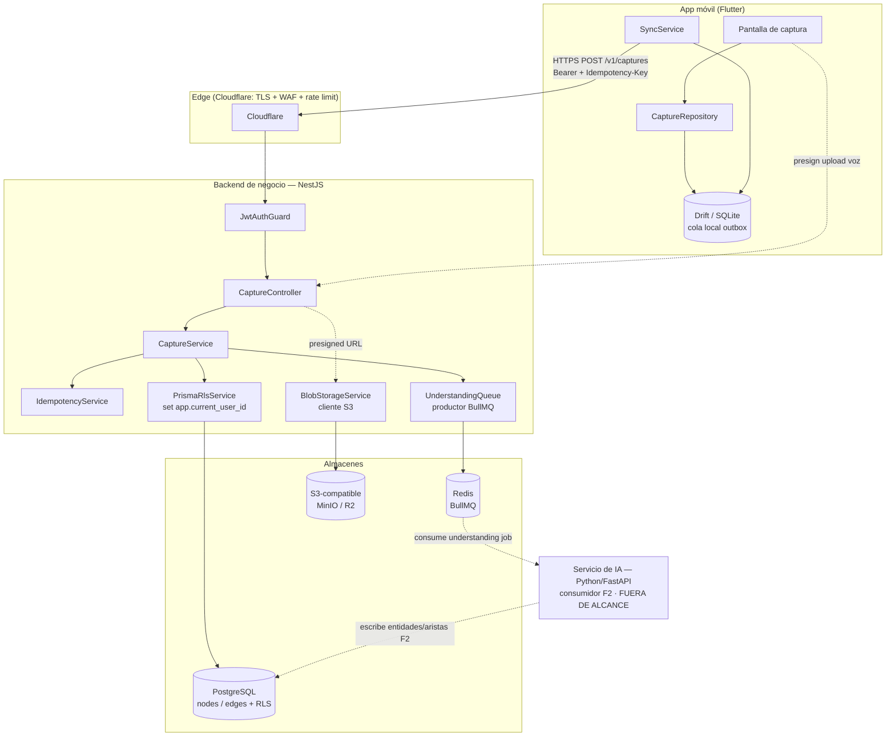
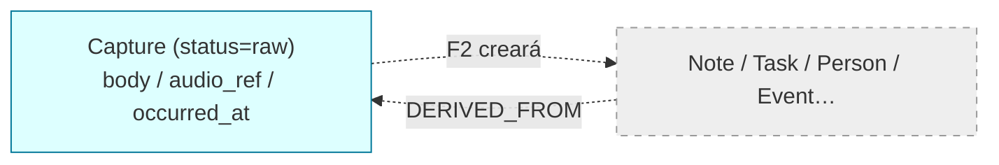

# Documento de Diseño — Capture Engine (F1)

| Metadato | Valor |
|----------|-------|
| Versión | 0.1 (borrador para revisión) |
| Estado | Borrador |
| Autor | Ingeniería (spec design-first) |
| Fase | F1 — Captura + persistencia ([#08 Roadmap](../../../docs/08-roadmap/technical-roadmap.md)) |
| Ámbito | Diseño técnico del motor de captura: API síncrona, modelo de grafo (nodes/edges + RLS), blobs de voz, handoff asíncrono a F2 y sync offline-first |
| Depende de | [ADR-010](../../../docs/02-architecture/adr/ADR-010-final-stack-and-two-backends.md), [ADR-012](../../../docs/02-architecture/adr/ADR-012-canonical-stack.md), [#03 Data Model](../../../docs/03-data/data-architecture-and-domain-model.md), [#04 API](../../../docs/04-api/api-design-specification.md), [#02 TAD](../../../docs/02-architecture/technical-architecture.md), [002 Constitución](../../../docs/000_SYSTEM/002_ENGINEERING_CONSTITUTION.md) |
| Riesgos/deuda vinculados | [R-005](../../../docs/000_SYSTEM/012_RISK_AND_DEBT_REGISTER.md) (offline sync), [R-002](../../../docs/000_SYSTEM/012_RISK_AND_DEBT_REGISTER.md) (auth hardening), [D-002](../../../docs/000_SYSTEM/012_RISK_AND_DEBT_REGISTER.md) (nodes/edges+RLS) |
| Última actualización | 2026-07-02 |

---

## 1. Overview

El **Capture Engine** es el primer tercio real del bucle de valor de mindOS
(**capturar → comprender → recuperar valor**). Permite que un usuario autenticado
vuelque un pensamiento —texto o voz— desde la app móvil Flutter y que ese dato se
persista de forma **fiable e instantánea** como un nodo `Capture` del property
graph, y quede **encolado** para comprensión asíncrona posterior (F2, fuera de
alcance salvo el punto de entrega a la cola).

El diseño obedece dos principios inmutables de la Constitución
([002](../../../docs/000_SYSTEM/002_ENGINEERING_CONSTITUTION.md)): **la captura
cruda es sagrada y nunca se pierde** (§9) y **el fallo del pipeline de IA nunca
pierde la captura** (§10). En consecuencia, la persistencia de la captura y el
encolado de comprensión están desacoplados: si el encolado o el worker fallan, la
captura ya está a salvo y es recuperable/reintentable.

El alcance de F1 cubre cinco frentes: (1) el contrato de API síncrono
(`POST /v1/captures` + lectura/listado propios) con `Idempotency-Key` y objetivo
**p95 < 300 ms**; (2) el modelo de datos de bajo nivel (esquema Prisma de
`nodes`/`edges` + **RLS** por usuario); (3) el almacenamiento de blobs de voz en
S3-compatible (MinIO/R2); (4) el handoff asíncrono a F2 vía **BullMQ sobre Redis**;
y (5) la estrategia **offline-first** en Flutter con Drift y su protocolo de
sincronización idempotente (aborda [R-005](../../../docs/000_SYSTEM/012_RISK_AND_DEBT_REGISTER.md)).

> **Nota sobre deriva documental:** el stack de verdad es ADR-010/012 (Flutter +
> NestJS/Prisma + Python/FastAPI de IA). De #04/#06 se toman únicamente los
> **contratos y patrones vigentes** (idempotencia, `X-Request-Id`, camino
> síncrono de captura), NUNCA sus menciones pre-ADR-010 a "FastAPI único" o
> "frontend React/PWA".

---

# PARTE A — DISEÑO DE ALTO NIVEL (Diagramas e Interfaces)

## 2. Architecture

El Capture Engine es un **bounded context "Capture"** dentro del backend de negocio
NestJS ([ADR-010](../../../docs/02-architecture/adr/ADR-010-final-stack-and-two-backends.md)).
No vive en el servicio de IA; sólo **produce** un trabajo que el servicio Python
consumirá en F2.



**Frontera de responsabilidad (F1):**

| Responsabilidad | Dueño en F1 |
|-----------------|-------------|
| Autenticación JWT (Bearer) | NestJS `AuthModule` (ya existe) |
| Validar + persistir `Capture` cruda | NestJS `CaptureModule` |
| Idempotencia por `Idempotency-Key` | NestJS `CaptureModule` |
| Contexto RLS por request | NestJS `PrismaRlsService` |
| Presign / recepción del blob de voz | NestJS `BlobStorageService` + S3 |
| Encolar trabajo de comprensión | NestJS productor BullMQ |
| **Consumir** el trabajo y comprender | Python/FastAPI — **F2, fuera de alcance** |
| Cola offline + sync | Flutter (Drift + `SyncService`) |

## 3. Sequence Diagrams

### 3.1 Captura de texto (camino síncrono, objetivo p95 < 300 ms)

```mermaid
sequenceDiagram
    participant M as Móvil (Flutter)
    participant A as CaptureController (NestJS)
    participant I as IdempotencyService
    participant P as PostgreSQL (RLS)
    participant Q as BullMQ (Redis)

    M->>A: POST /v1/captures {type:text, content}<br/>Bearer + Idempotency-Key + X-Request-Id
    A->>A: JwtAuthGuard valida token -> user_id
    A->>I: lookup(user_id, key)
    alt clave ya vista (reintento)
        I-->>A: captura previa
        A-->>M: 202 {capture_id, status} (misma respuesta)
    else clave nueva
        A->>P: SET app.current_user_id; INSERT node (type=capture, status=raw)
        P-->>A: capture_id
        A->>I: store(user_id, key, capture_id)
        A->>Q: enqueue understanding.process {capture_id, user_id}
        Note over A,Q: si el enqueue falla -> la captura YA está persistida<br/>(se reintenta por outbox/barrido)
        A-->>M: 202 Accepted {capture_id, status:raw, created_at}
    end
```

### 3.2 Captura de voz (subida directa del audio a S3 vía presigned URL)

```mermaid
sequenceDiagram
    participant M as Móvil (Flutter)
    participant A as CaptureController (NestJS)
    participant S as S3 (MinIO/R2)
    participant P as PostgreSQL

    M->>A: POST /v1/captures/audio-upload {content_type, size}
    A->>A: valida tipo/tamaño; genera object key<br/>audio/{user_id}/{uuid}.m4a
    A->>S: crea presigned PUT URL (TTL corto)
    A-->>M: 200 {upload_url, audio_ref}
    M->>S: PUT audio (binario) directo a S3
    S-->>M: 200 OK
    M->>A: POST /v1/captures {type:voice, content:<transcripción?>, audio_ref}
    A->>A: verifica que audio_ref pertenece al user y existe en S3
    A->>P: INSERT node (type=capture, origin=voice, attributes.audio_ref)
    A-->>M: 202 {capture_id, status:raw}
```

> El binario de audio **nunca** entra en PostgreSQL (antipatrón, ADR-012 D6). El
> nodo `Capture` guarda sólo la **clave/URI del objeto** en `attributes.audio_ref`.

### 3.3 Sincronización offline (recuperación de conexión)

```mermaid
sequenceDiagram
    participant U as Usuario
    participant UI as UI Flutter
    participant D as Drift (outbox local)
    participant SY as SyncService
    participant A as API NestJS

    U->>UI: captura sin conexión
    UI->>D: INSERT local_capture (client_id UUID, sync_state=pending)
    UI-->>U: "guardado" (optimista, <3s)
    Note over D: la captura ya está a salvo en el dispositivo
    SY->>D: al recuperar red, lee lote pending (orden FIFO)
    loop por cada captura pendiente
        SY->>A: POST /v1/captures + Idempotency-Key = client_id
        alt 202 creada / 200 ya existía
            A-->>SY: {capture_id, status}
            SY->>D: UPDATE sync_state=synced, server_id
        else 5xx / red caída
            A-->>SY: error
            SY->>D: backoff exponencial; reintento posterior
        end
    end
```

## 4. Modelo conceptual del grafo (contexto)

F1 introduce **físicamente** las tablas `nodes` y `edges` del property graph del
[#03](../../../docs/03-data/data-architecture-and-domain-model.md), pero sólo crea
nodos de tipo `Capture` (`status=raw`). Los demás tipos de nodo y las aristas
semánticas (`MENTIONS`, `ASSIGNED_TO`, …) los generará F2.



- **En F1 existe:** el nodo `Capture` y (opcionalmente) la arista de provenance
  no aplica todavía (no hay nodos derivados).
- **Contrato con F2:** F2 leerá la `Capture` por `capture_id`, creará nodos
  derivados y aristas `DERIVED_FROM` apuntando a la `Capture`, y transicionará
  `status` `raw → processing → processed` (o `failed`).

---

# PARTE B — DISEÑO DE BAJO NIVEL (Code-First)

## 5. Modelo de datos — esquema Prisma (`nodes` / `edges`)

Hoy `schema.prisma` sólo tiene `User` ([D-002](../../../docs/000_SYSTEM/012_RISK_AND_DEBT_REGISTER.md)).
F1 añade el grafo. Se sigue el DDL ilustrativo del #03 §6, concretándolo como
modelo Prisma. La `Capture` es el primer `NodeType`.

```prisma
// apps/api/prisma/schema.prisma  (añadido en F1)

enum NodeType {
  capture
  note
  task
  person
  project
  event
  decision
  topic

  @@map("node_type")
}

/// Estado del pipeline de comprensión sobre una captura (ADR-02 / #03 §5).
/// F1 sólo escribe `raw`. F2 transiciona raw -> processing -> processed | failed.
enum CaptureStatus {
  raw
  processing
  processed
  failed

  @@map("capture_status")
}

enum CaptureModality {
  text
  voice

  @@map("capture_modality")
}

enum NodeOrigin {
  manual_text
  voice
  calendar_sync
  ai

  @@map("node_origin")
}

/// Nodo del property graph. Todos los tipos comparten esta tabla, discriminados
/// por `type`. Campos específicos del tipo viven en `attributes` (JSONB).
model Node {
  id          String       @id @default(uuid()) @db.Uuid
  userId      String       @map("user_id") @db.Uuid
  type        NodeType
  title       String?
  body        String?                       // contenido crudo de texto/transcripción
  attributes  Json         @default("{}")   // p.ej. { "audio_ref": "...", "modality": "voice" }
  status      CaptureStatus @default(raw)    // relevante para type=capture
  origin      NodeOrigin
  confidence  Float?                          // null para capturas (no derivadas por IA)
  // embedding VECTOR(1536) -> se añade en F2 vía migración SQL cruda (pgvector)
  occurredAt  DateTime?    @map("occurred_at") @db.Timestamptz(6)
  createdAt   DateTime     @default(now()) @map("created_at") @db.Timestamptz(6)
  updatedAt   DateTime     @updatedAt @map("updated_at") @db.Timestamptz(6)
  deletedAt   DateTime?    @map("deleted_at") @db.Timestamptz(6)

  user            User             @relation(fields: [userId], references: [id], onDelete: Cascade)
  outgoingEdges   Edge[]           @relation("SourceNode")
  incomingEdges   Edge[]           @relation("TargetNode")
  idempotencyKeys IdempotencyKey[]

  @@index([userId, type], name: "idx_nodes_user_type")
  @@index([userId, status])
  @@map("nodes")
}

/// Arista tipada y direccional (lista de adyacencia). F1 no crea aristas;
/// se define el modelo para que F2 lo use sin nueva migración estructural.
model Edge {
  id            String     @id @default(uuid()) @db.Uuid
  userId        String     @map("user_id") @db.Uuid
  type          String                                   // 'derived_from','mentions',...
  sourceNodeId  String     @map("source_node_id") @db.Uuid
  targetNodeId  String     @map("target_node_id") @db.Uuid
  confidence    Float?
  origin        String                                   // 'ai' | 'user' | 'integration'
  userConfirmed Boolean    @default(false) @map("user_confirmed")
  createdAt     DateTime   @default(now()) @map("created_at") @db.Timestamptz(6)
  deletedAt     DateTime?  @map("deleted_at") @db.Timestamptz(6)

  sourceNode Node @relation("SourceNode", fields: [sourceNodeId], references: [id], onDelete: Cascade)
  targetNode Node @relation("TargetNode", fields: [targetNodeId], references: [id], onDelete: Cascade)
  user       User @relation(fields: [userId], references: [id], onDelete: Cascade)

  @@index([userId, sourceNodeId], name: "idx_edges_source")
  @@index([userId, targetNodeId], name: "idx_edges_target")
  @@map("edges")
}

/// Registro de idempotencia para POST /v1/captures. La clave la provee el
/// cliente (Idempotency-Key); en sync offline es el client_id de Drift.
model IdempotencyKey {
  id         String   @id @default(uuid()) @db.Uuid
  userId     String   @map("user_id") @db.Uuid
  key        String
  captureId  String   @map("capture_id") @db.Uuid
  requestHash String  @map("request_hash")   // hash del payload para detectar reuso con distinto cuerpo
  createdAt  DateTime @default(now()) @map("created_at") @db.Timestamptz(6)

  capture Node @relation(fields: [captureId], references: [id], onDelete: Cascade)
  user    User @relation(fields: [userId], references: [id], onDelete: Cascade)

  @@unique([userId, key], name: "uq_idempotency_user_key")
  @@map("idempotency_keys")
}
```

> `User` gana las relaciones inversas `nodes Node[]`, `edges Edge[]`,
> `idempotencyKeys IdempotencyKey[]`. La columna `embedding VECTOR(1536)` y sus
> índices HNSW se añaden en **F2** mediante migración SQL cruda (Prisma no tipa
> `pgvector` nativamente); no es necesaria para F1.

## 6. Aislamiento por usuario — DDL y políticas RLS

RLS es la **segunda línea de defensa** (#03 §6): aunque la capa de aplicación
siempre filtra por `user_id`, Postgres garantiza el aislamiento aun ante un bug.
Se aplica vía migración SQL cruda tras `prisma migrate`.

```sql
-- migración F1: habilitar RLS sobre el grafo
ALTER TABLE nodes            ENABLE ROW LEVEL SECURITY;
ALTER TABLE edges            ENABLE ROW LEVEL SECURITY;
ALTER TABLE idempotency_keys ENABLE ROW LEVEL SECURITY;

-- forzar RLS incluso para el dueño de la tabla (defensa fuerte)
ALTER TABLE nodes            FORCE ROW LEVEL SECURITY;
ALTER TABLE edges            FORCE ROW LEVEL SECURITY;
ALTER TABLE idempotency_keys FORCE ROW LEVEL SECURITY;

-- política de aislamiento: sólo filas del usuario del contexto de sesión.
-- USING filtra lecturas/updates; WITH CHECK impide insertar filas de otro user.
CREATE POLICY nodes_isolation ON nodes
    USING      (user_id = current_setting('app.current_user_id', true)::uuid)
    WITH CHECK (user_id = current_setting('app.current_user_id', true)::uuid);

CREATE POLICY edges_isolation ON edges
    USING      (user_id = current_setting('app.current_user_id', true)::uuid)
    WITH CHECK (user_id = current_setting('app.current_user_id', true)::uuid);

CREATE POLICY idem_isolation ON idempotency_keys
    USING      (user_id = current_setting('app.current_user_id', true)::uuid)
    WITH CHECK (user_id = current_setting('app.current_user_id', true)::uuid);
```

- El segundo argumento `true` de `current_setting(..., true)` hace que devuelva
  `NULL` si la variable no está fijada (en vez de error). Con `user_id = NULL` la
  política **no deja ver ni escribir nada** → *fail-closed*: una request sin
  contexto de usuario no accede a datos.
- La aplicación conecta como un rol **no superusuario y no dueño de tabla**, de
  modo que `FORCE ROW LEVEL SECURITY` aplique siempre.

### 6.1 Cómo NestJS/Prisma establecen el contexto de usuario

Prisma usa un pool de conexiones; hay que garantizar que el `SET` de
`app.current_user_id` y las consultas de la request corran **en la misma
conexión**. Se usa una transacción interactiva por request de dominio:

```typescript
// apps/api/src/prisma/prisma-rls.service.ts
import { Injectable } from '@nestjs/common';
import { Prisma } from '@prisma/client';
import { PrismaService } from './prisma.service';

@Injectable()
export class PrismaRlsService {
  constructor(private readonly prisma: PrismaService) {}

  /**
   * Ejecuta `work` dentro de una transacción donde app.current_user_id está
   * fijado, de modo que las políticas RLS filtren por ese usuario.
   * set_config(..., true) => local a la transacción (se limpia al terminar).
   */
  async withUser<T>(
    userId: string,
    work: (tx: Prisma.TransactionClient) => Promise<T>,
  ): Promise<T> {
    return this.prisma.$transaction(async (tx) => {
      // parametrizado para evitar cualquier inyección en el UUID
      await tx.$executeRaw`SELECT set_config('app.current_user_id', ${userId}, true)`;
      return work(tx);
    });
  }
}
```

> **Precondición:** `userId` proviene del JWT verificado por `JwtAuthGuard`
> (ya existe), nunca del cuerpo de la petición. **Postcondición:** toda lectura
> o escritura dentro de `work` queda restringida a filas de `userId` por RLS.

## 7. Contrato de API — endpoints y DTOs

Convenciones heredadas de #04: `Bearer` obligatorio, UUID v4, ISO-8601 UTC,
`snake_case` en JSON, envoltura de error estándar, `X-Request-Id` propagado.

### 7.1 `POST /v1/captures` — crear captura (FR-1.1, FR-1.2, FR-1.3)

- **Headers:** `Authorization: Bearer <access>`, `Idempotency-Key: <uuid>` (obligatorio), `X-Request-Id` (opcional).
- **Respuesta:** `202 Accepted` (persistida + encolada). La comprensión ocurre después.

```typescript
// apps/api/src/capture/dto/create-capture.dto.ts
import {
  IsEnum, IsOptional, IsString, MaxLength, MinLength, IsUUID, IsISO8601,
} from 'class-validator';

export enum CaptureType { text = 'text', voice = 'voice' }

export class CreateCaptureDto {
  @IsEnum(CaptureType)
  type!: CaptureType;

  // Texto crudo o transcripción de voz. Requerido salvo voz sin transcribir aún.
  @IsOptional()
  @IsString()
  @MinLength(1)
  @MaxLength(20_000)
  content?: string;

  // Referencia al objeto de audio en S3 (obtenida de /audio-upload). Sólo voz.
  @IsOptional()
  @IsString()
  @MaxLength(512)
  audio_ref?: string;

  // Momento en que ocurrió el hecho, si el cliente lo conoce (modelo temporal #03 §9).
  @IsOptional()
  @IsISO8601()
  occurred_at?: string;

  // client_id del outbox de Drift; permite trazar la captura offline original.
  @IsOptional()
  @IsUUID()
  client_id?: string;
}

export interface CaptureResponse {
  capture_id: string;
  status: 'raw' | 'processing' | 'processed' | 'failed';
  created_at: string;   // ISO-8601 UTC
  occurred_at: string | null;
}
```

```typescript
// apps/api/src/capture/capture.controller.ts (firmas)
@UseGuards(JwtAuthGuard)
@Controller({ path: 'captures', version: '1' })
export class CaptureController {
  constructor(private readonly captures: CaptureService) {}

  // 202 Accepted (o repetición idempotente). Objetivo p95 < 300 ms.
  @Post()
  @HttpCode(202)
  create(
    @CurrentUser() user: AuthenticatedUser,
    @Headers('idempotency-key') idempotencyKey: string,
    @Body() dto: CreateCaptureDto,
  ): Promise<CaptureResponse> { /* ... */ }

  // Presign para subir el audio directo a S3 antes de crear la captura de voz.
  @Post('audio-upload')
  @HttpCode(200)
  presignAudio(
    @CurrentUser() user: AuthenticatedUser,
    @Body() dto: PresignAudioDto,        // { content_type, size_bytes }
  ): Promise<{ upload_url: string; audio_ref: string; expires_in: number }> { /* ... */ }

  // Lectura de la propia captura (RLS + filtro user_id). Base del polling F2.
  @Get(':id')
  findOne(
    @CurrentUser() user: AuthenticatedUser,
    @Param('id', ParseUUIDPipe) id: string,
  ): Promise<CaptureResponse & { derived_nodes?: string[] }> { /* ... */ }

  // Listado paginado por cursor de las capturas propias.
  @Get()
  list(
    @CurrentUser() user: AuthenticatedUser,
    @Query() q: ListCapturesQueryDto,     // { limit?, cursor?, status? }
  ): Promise<{ data: CaptureResponse[]; next_cursor: string | null }> { /* ... */ }
}
```

### 7.2 Semántica de `Idempotency-Key`

| Situación | Comportamiento |
|-----------|----------------|
| Clave nueva | Se crea la captura, se guarda `(user_id, key) → capture_id` + `request_hash`, se encola, `202`. |
| Clave repetida, **mismo** payload | No se crea nada nuevo; se devuelve la misma `CaptureResponse`, `202`. |
| Clave repetida, payload **distinto** | `409 Conflict` (`idempotency_key_reuse`): la clave ya se usó con otro contenido. |
| Falta la clave | `400` (`missing_idempotency_key`). |

> La clave se guarda con `@@unique([userId, key])`; el `request_hash` detecta el
> reuso con cuerpo distinto. En sync offline, `Idempotency-Key = client_id`, así
> el reintento del móvil nunca duplica.

## 8. Estructura de módulos NestJS (bounded context Capture)

```
apps/api/src/
├── app.module.ts                 # + CaptureModule
├── prisma/
│   ├── prisma.service.ts         # (existe)
│   └── prisma-rls.service.ts     # NUEVO: withUser() -> set app.current_user_id
└── capture/
    ├── capture.module.ts         # imports: PrismaModule, BullMQ queue, BlobModule
    ├── capture.controller.ts     # endpoints §7
    ├── capture.service.ts        # orquesta: idempotencia -> persistir -> encolar
    ├── idempotency.service.ts    # lookup/store de Idempotency-Key
    ├── blob-storage.service.ts   # cliente S3 (presign PUT/GET) — MinIO/R2
    ├── understanding.queue.ts    # productor BullMQ (contrato §10)
    └── dto/
        ├── create-capture.dto.ts
        ├── presign-audio.dto.ts
        └── list-captures-query.dto.ts
```

Reglas de #07 aplicables: DTOs validados con `class-validator` en el borde,
`any` prohibido, un bounded context no importa internals de otro (Capture usa
`AuthModule`/`PrismaModule` por interfaces públicas), promesas siempre esperadas.

```typescript
// apps/api/src/capture/capture.service.ts  (núcleo del flujo síncrono)
@Injectable()
export class CaptureService {
  constructor(
    private readonly rls: PrismaRlsService,
    private readonly idempotency: IdempotencyService,
    private readonly queue: UnderstandingQueue,
    private readonly blobs: BlobStorageService,
  ) {}

  async create(userId: string, key: string, dto: CreateCaptureDto): Promise<CaptureResponse> {
    // 1) idempotencia (fail-fast si la clave ya existe)
    const prior = await this.idempotency.lookup(userId, key, dto);
    if (prior) return prior;                       // reintento -> misma respuesta

    // 2) validación de blob de voz (si aplica): el audio_ref debe existir y ser del user
    if (dto.type === CaptureType.voice && dto.audio_ref) {
      await this.blobs.assertOwnedAndExists(userId, dto.audio_ref);
    }

    // 3) persistir la captura cruda + registro de idempotencia en UNA transacción
    //    (RLS activo). La captura queda a salvo antes de encolar nada.
    const capture = await this.rls.withUser(userId, async (tx) => {
      const node = await tx.node.create({
        data: {
          userId, type: 'capture', status: 'raw',
          origin: dto.type === CaptureType.voice ? 'voice' : 'manual_text',
          body: dto.content ?? null,
          attributes: dto.audio_ref ? { audio_ref: dto.audio_ref, modality: dto.type } : { modality: dto.type },
          occurredAt: dto.occurred_at ? new Date(dto.occurred_at) : null,
        },
      });
      await tx.idempotencyKey.create({
        data: { userId, key, captureId: node.id, requestHash: hashPayload(dto) },
      });
      return node;
    });

    // 4) encolar comprensión (F2). Si esto falla, la captura YA está persistida:
    //    un barrido de reconciliación reencola capturas raw sin job (ver §10.2).
    await this.queue.enqueueUnderstanding({ captureId: capture.id, userId });

    return toResponse(capture);
  }
}
```

## 9. Almacenamiento de blobs de voz (S3-compatible)

Decisión ADR-012 D6: **API S3-compatible**, MinIO en local y Cloudflare R2 en
prod, un único cliente, backend intercambiable. El audio **nunca** en Postgres.

- **Subida directa vía presigned URL (elegido).** El móvil sube el binario
  directo a S3 con una URL firmada de vida corta; la API no proxya bytes de
  audio. Ventajas: la API se mantiene ligera y rápida (protege el p95 < 300 ms),
  menos ancho de banda en el backend, y el camino de captura no depende del
  tamaño del audio.
- **Alternativa (vía API multipart):** rechazada para F1 — cargaría el backend
  con el streaming del binario y presionaría el SLO de latencia. Se reconsidera
  sólo si el edge/red obliga.

```
Object key:  audio/{user_id}/{capture_client_uuid}.{ext}
Guardado en el nodo:  attributes.audio_ref = "audio/{user_id}/{uuid}.m4a"
Acceso posterior (F2 / reproducción): presigned GET URL de vida corta.
```

```typescript
// apps/api/src/capture/blob-storage.service.ts (firmas)
export interface BlobStorageService {
  // Presigned PUT: el cliente sube el audio directo a S3.
  presignUpload(userId: string, contentType: string, sizeBytes: number):
    Promise<{ upload_url: string; audio_ref: string; expires_in: number }>;

  // Verifica que la key pertenece al user (prefijo audio/{user_id}/) y existe.
  assertOwnedAndExists(userId: string, audioRef: string): Promise<void>;

  // Presigned GET para lectura (usado por F2 y por reproducción en la app).
  presignDownload(userId: string, audioRef: string): Promise<string>;
}
```

- **Validaciones:** `content_type` en allowlist (`audio/m4a`, `audio/mpeg`,
  `audio/webm`), tamaño máximo (p.ej. 25 MB), y el prefijo de la key **debe**
  contener el `user_id` del token → un usuario no puede referenciar el audio de
  otro. Se mantiene aislamiento incluso fuera de RLS (que sólo protege Postgres).

## 10. Contrato del mensaje de cola (handoff a F2)

BullMQ sobre Redis (ADR-012 D7). NestJS es **productor**; el consumidor es el
servicio Python de IA (F2). F1 sólo define y produce el mensaje.

```typescript
// apps/api/src/capture/understanding.queue.ts
export const UNDERSTANDING_QUEUE = 'understanding';
export const UNDERSTANDING_JOB = 'understanding.process';

/** Contrato del mensaje. Versionado para evolución sin romper al consumidor. */
export interface UnderstandingJobData {
  schema_version: 1;
  capture_id: string;    // UUID del nodo Capture ya persistido
  user_id: string;       // dueño (el consumidor fija app.current_user_id con esto)
  enqueued_at: string;   // ISO-8601 UTC
}

// Opciones del job (garantías de fiabilidad):
export const understandingJobOpts = {
  jobId: '<capture_id>',          // dedup: mismo capture_id => un solo job
  attempts: 5,                    // reintentos ante fallo del worker
  backoff: { type: 'exponential', delay: 2_000 },
  removeOnComplete: 1_000,
  removeOnFail: false,            // conserva fallidos para inspección/replay
};
```

### 10.1 Garantía "la captura nunca se pierde"

1. La captura se **persiste antes** de encolar (§8, transacción). Si el proceso
   muere entre persistir y encolar, la captura sigue en Postgres con `status=raw`.
2. `jobId = capture_id` → **idempotencia del encolado**: reintentos de red no
   crean jobs duplicados.
3. El worker de F2 es **idempotente**: reprocesar una `Capture` produce el mismo
   grafo (upsert por `(user_id, capture_id, tipo)`); un job entregado más de una
   vez no duplica entidades.
4. Ante fallo del worker tras `attempts`, el job queda en la cola de fallidos
   (`removeOnFail:false`) para inspección/replay; la captura cruda permanece
   intacta.

### 10.2 Barrido de reconciliación (red de seguridad)

Un job programado (cron) reencola capturas con `status=raw` cuya antigüedad supere
un umbral (p.ej. 5 min) y que no tengan job activo. Cubre el hueco "persistida pero
nunca encolada" (fallo justo tras el commit). Es idempotente por `jobId`.

## 11. Offline-first / sync en Flutter (aborda R-005)

Estrategia **outbox local**: la captura se guarda primero en Drift (SQLite) y se
sincroniza con la API en segundo plano. La UI confirma de forma optimista (<3s),
cumpliendo FR-1.1 aun sin red.

### 11.1 Esquema local (Drift)

```dart
// apps/mobile/lib/src/features/capture/data/local/capture_tables.dart
class LocalCaptures extends Table {
  // client_id: UUID generado en el dispositivo. Es la Idempotency-Key con la API.
  TextColumn get clientId => text()();
  TextColumn get type => text()();               // 'text' | 'voice'
  TextColumn get content => text().nullable()();
  TextColumn get audioLocalPath => text().nullable()(); // ruta del archivo local
  TextColumn get audioRef => text().nullable()();       // key S3 tras subir
  DateTimeColumn get occurredAt => dateTime().nullable()();
  DateTimeColumn get createdAtLocal => dateTime()();
  // sync_state: pending -> uploading_audio -> syncing -> synced | failed
  TextColumn get syncState => text().withDefault(const Constant('pending'))();
  TextColumn get serverId => text().nullable()();       // capture_id devuelto
  IntColumn get retryCount => integer().withDefault(const Constant(0))();
  DateTimeColumn get nextAttemptAt => dateTime().nullable()();

  @override
  Set<Column> get primaryKey => {clientId};
}
```

### 11.2 Protocolo de sincronización

```
1. CAPTURA LOCAL
   - generar client_id = UUID v4
   - INSERT en LocalCaptures (sync_state = pending)
   - UI muestra "guardado" (optimista)  ← la captura ya está a salvo en el device

2. TRIGGER DE SYNC (al recuperar conectividad / periódico / al abrir la app)
   - leer lote de sync_state IN (pending, failed) con next_attempt_at <= now, orden FIFO
   - para cada captura de voz aún sin audio_ref:
       a. presignAudio() -> subir archivo a S3 -> guardar audio_ref (sync_state=syncing)
   - POST /v1/captures con header Idempotency-Key = client_id
       * 202 (creada) o 200 (ya existía)  -> sync_state = synced, server_id = capture_id
       * 4xx de validación (no reintentar) -> sync_state = failed (marcar para revisión)
       * 5xx / timeout / sin red           -> retry_count++, backoff exponencial en next_attempt_at

3. RESOLUCIÓN DE CONFLICTOS / DUPLICADOS
   - la unicidad la garantiza la API por (user_id, Idempotency-Key): reenviar el
     mismo client_id NUNCA crea una segunda captura.
   - reinstalación / multi-dispositivo: client_id se persiste en Drift; el mismo
     dispositivo reusa su client_id. La captura es inmutable tras crearse (append-only),
     así que no hay conflicto de escritura concurrente sobre el mismo recurso.
```

- **Capas Flutter (#07 §4):** UI → `captureProvider` (Riverpod) →
  `CaptureRepository` → Drift; la UI no llama a red directamente. `SyncService`
  observa la conectividad y drena el outbox.
- **Garantía offline:** una captura hecha sin red persiste en Drift y se
  sincroniza al reconectar; el cierre de la app no la pierde (está en SQLite).

---

## 12. Correctness Properties

Propiedades verificables (candidatas a PBT, #07 §5). Cada una enlaza al requisito
o principio que valida.

- **P1 — Aislamiento por dueño (RLS).** *Validates: FR-X.2, Constitución §7.*
  Para toda captura `c` creada por el usuario `u`, `GET /v1/captures/{c}` con el
  token de `u` la devuelve, y con el token de cualquier `u' ≠ u` devuelve `404`
  (nunca `403` con datos, nunca el contenido). Ninguna consulta de `u'` incluye
  `c` en su listado.
  ```
  ∀ c, u, u': (owner(c) = u ∧ u' ≠ u) ⟹ visible(c, u) ∧ ¬visible(c, u')
  ```

- **P2 — La captura nunca se pierde ante fallo del worker.** *Validates: Constitución §9, §10; R-005.*
  Si `POST /v1/captures` devolvió `202`, la `Capture` es recuperable por su dueño
  independientemente de cualquier fallo posterior del encolado o del worker de F2.
  ```
  ∀ c: accepted(c) ⟹ ◇ recoverable(c)   (persistencia previa al encolado)
  ```

- **P3 — Idempotencia de creación.** *Validates: FR-1.1 (#04 idempotencia).*
  Reenviar `POST /v1/captures` con la misma `Idempotency-Key` y el mismo payload
  no crea una segunda captura y devuelve la misma `capture_id`.
  ```
  ∀ key, p: create(key, p) = create(key, p)  (mismo capture_id; una sola fila)
  ```

- **P4 — Detección de reuso incoherente de clave.** *Validates: integridad de idempotencia.*
  Reenviar la misma `Idempotency-Key` con un payload distinto devuelve `409` y no
  modifica la captura original.

- **P5 — Coherencia temporal.** *Validates: modelo temporal #03 §9.*
  Para toda captura, `occurred_at ≤ created_at` cuando `occurred_at` está presente
  (no se puede haber "sabido" antes de que ocurriera el registro).
  ```
  ∀ c: c.occurred_at ≠ null ⟹ c.occurred_at ≤ c.created_at
  ```

- **P6 — El audio nunca entra en Postgres.** *Validates: ADR-012 D6.*
  Para toda captura de voz, la tabla `nodes` sólo contiene una referencia
  (`attributes.audio_ref`), nunca el binario; el objeto vive en S3 bajo un prefijo
  que contiene el `user_id` del dueño.

- **P7 — Idempotencia del handoff.** *Validates: §10.1, Constitución §10.*
  Un `understanding.process` con el mismo `capture_id` encolado o entregado más de
  una vez resulta en un único procesamiento efectivo (dedup por `jobId`), sin
  entidades duplicadas.

- **P8 — Fail-closed sin contexto de usuario.** *Validates: RLS §6.*
  Una consulta ejecutada sin `app.current_user_id` fijado no devuelve ni escribe
  ninguna fila de `nodes`/`edges`.

- **P9 — Sync offline idempotente.** *Validates: R-005.*
  Una captura del outbox de Drift reenviada N veces (por reintentos/reconexiones)
  produce exactamente una captura en el servidor, porque `Idempotency-Key = client_id`.

## 13. Error Handling

Envoltura de error estándar de #04 (`{ error: { code, message, request_id } }`).

| Escenario | Condición | Respuesta | Recuperación |
|-----------|-----------|-----------|--------------|
| Falta `Idempotency-Key` | Header ausente | `400 missing_idempotency_key` | El cliente reintenta con clave. |
| Reuso incoherente de clave | Misma clave, distinto payload | `409 idempotency_key_reuse` | El cliente genera nueva clave si es captura nueva. |
| Payload inválido | DTO no valida | `400 validation_error` | Corregir cuerpo; en sync → `sync_state=failed`. |
| `audio_ref` ajeno/inexistente | Prefijo no del user o no existe en S3 | `403 forbidden` / `422` | Re-subir audio y reintentar. |
| Token ausente/expirado | JWT inválido | `401` | Refresh token y reintentar. |
| Fallo al encolar (Redis caído) | La captura ya se persistió | `202` igualmente | Barrido de reconciliación reencola (§10.2). |
| Fallo del worker F2 | Excede `attempts` | (async, no afecta al `202`) | Job en cola de fallidos; captura intacta; replay. |
| Sin red (móvil) | Sync falla | — (offline) | Outbox reintenta con backoff. |

**Principio (#07 §1):** manejo de errores explícito; el fallo degrada
funcionalidad **sin perder la captura**.

## 14. Testing Strategy

- **Unit (NestJS):** `CaptureService` (idempotencia, orden persistir→encolar),
  `IdempotencyService`, `BlobStorageService` (allowlist, ownership de key),
  `PrismaRlsService.withUser` (fija y limpia el contexto).
- **Property-Based (PBT):** propiedades P1–P9 (§12). Librería **fast-check**
  (TS). Foco en idempotencia (P3/P4/P9), no-pérdida (P2), aislamiento (P1/P8) y
  coherencia temporal (P5) — exactamente el "sí" de #07 §5.
- **Integración:** contra PostgreSQL real con RLS activado y un rol no-owner
  (verificar P1/P8 de verdad, no mockeado); MinIO local para S3; Redis real para
  BullMQ (verificar dedup por `jobId`, P7).
- **Flutter:** tests de `CaptureRepository` + `SyncService` sobre Drift en memoria
  (P9: reenvíos idempotentes; persistencia offline; máquina de estados de sync).
- **Cobertura:** ≥ 80 % en lógica de dominio; camino de captura aspira a más
  (#07 §1).

## 15. Performance Considerations

- **SLO:** `POST /v1/captures` **p95 < 300 ms** (DoD de F1, #08). Se protege
  manteniendo el camino síncrono mínimo: una transacción de INSERT + un `enqueue`
  no bloqueante. El audio va por presigned URL directo a S3, **fuera** del camino
  de la API.
- Índices `idx_nodes_user_type` e `idx_nodes_user_status` cubren listado/lectura.
- La comprensión (coste LLM/CPU) es 100% asíncrona (Constitución §12).
- Rate limiting por usuario en el edge (Cloudflare, ADR-012 D5) sobre
  `POST /captures`.

## 16. Security Considerations

- **AuthN:** `JwtAuthGuard` (Bearer access de vida corta) — ya existe.
- **AuthZ + aislamiento:** filtro por `user_id` del token **y** RLS fail-closed
  en Postgres (doble capa, #03 §6). `user_id` jamás se toma del cuerpo.
- **Blobs:** keys namespaced por `user_id`; presigned URLs de vida corta;
  allowlist de `content_type` y límite de tamaño.
- **Deuda vigente relacionada:** endurecimiento de la auth propia
  ([R-002](../../../docs/000_SYSTEM/012_RISK_AND_DEBT_REGISTER.md)) y comparación
  en tiempo constante en login ([D-003](../../../docs/000_SYSTEM/012_RISK_AND_DEBT_REGISTER.md))
  se abordan en F4; F1 no los resuelve pero no debe empeorarlos.
- **Transporte:** sólo HTTPS/TLS (edge Cloudflare).

## 17. Dependencies

| Dependencia | Uso en F1 | Fuente |
|-------------|-----------|--------|
| NestJS + Prisma | API de negocio y ORM | ADR-010 |
| PostgreSQL (+ RLS; pgvector en F2) | grafo `nodes`/`edges`, aislamiento | ADR-012 D2 |
| Redis + BullMQ | cola de comprensión (productor) | ADR-012 D7 |
| S3-compatible (MinIO local / R2 prod) | blobs de voz | ADR-012 D6 |
| Flutter + Drift + Riverpod + GoRouter | captura móvil + outbox offline | ADR-010 |
| Cloudflare | TLS + WAF + rate limiting (edge) | ADR-012 D5 |
| `class-validator` / `class-transformer` | validación de DTOs en el borde | #07 §2 |
| Servicio Python/FastAPI (IA) | **consumidor** del job (F2) | ADR-010 — fuera de alcance |

---

## 18. Riesgos y decisiones abiertas

| Ref | Tema | Estado en este diseño |
|-----|------|-----------------------|
| [R-005](../../../docs/000_SYSTEM/012_RISK_AND_DEBT_REGISTER.md) | Offline-first / sync Drift↔API | **Abordado** por el protocolo outbox + idempotencia por `client_id` (§11). Pendiente validar en implementación. |
| [D-002](../../../docs/000_SYSTEM/012_RISK_AND_DEBT_REGISTER.md) | `nodes`/`edges` + RLS no implementados | **Diseñado** (§5, §6); se implementa en las tareas de F1. |
| [R-002](../../../docs/000_SYSTEM/012_RISK_AND_DEBT_REGISTER.md) | Auth propia sin endurecer | Fuera de alcance de F1 (F4); F1 reutiliza la auth existente sin degradarla. |
| Abierta | Dimensión del vector de embedding | Diferida a F2 (depende del proveedor, #07). No afecta F1. |
| Abierta | Transcripción de voz: ¿en cliente o en F2 (servicio IA)? | F1 acepta ambas: `content` (transcrito en cliente) y/o `audio_ref` (transcripción diferida a F2). Decisión final con datos de calidad/latencia. |
| Abierta | Contrato push (WebSocket) de `capture.processed` | F1 usa **polling** de `GET /v1/captures/{id}` (heredado de #04 §6); el push llega con la capa realtime posterior. |

---

## Historial de versiones

| Versión | Fecha | Autor | Cambios |
|---------|-------|-------|---------|
| 0.1 | 2026-07-02 | Ingeniería | Diseño inicial del Capture Engine (F1): alto nivel (arquitectura, secuencias texto/voz/sync, modelo conceptual) y bajo nivel (esquema Prisma nodes/edges, RLS + contexto de usuario, endpoints/DTOs, módulos NestJS, blobs S3, contrato de cola BullMQ, esquema Drift + protocolo de sync), propiedades de correctitud, manejo de errores, testing, rendimiento, seguridad y riesgos/decisiones abiertas (R-005, D-002, ADR-010/012). |
