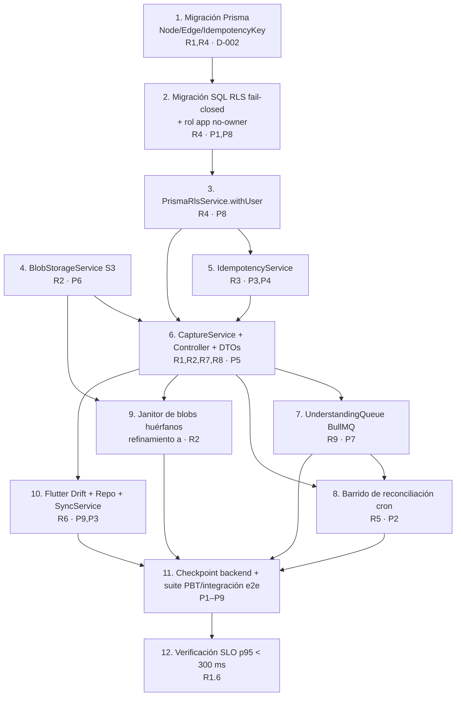

# Plan de Implementación — Capture Engine (F1)

| Metadato | Valor |
|----------|-------|
| Versión | 0.1 (borrador para revisión) |
| Estado | Borrador |
| Autor | Ingeniería (spec design-first) |
| Ámbito | Plan de tareas de código para F1: migración del grafo `nodes`/`edges` + RLS fail-closed, servicios de dominio (RLS, idempotencia, blobs, cola), API de captura (texto/voz, lectura/listado), handoff BullMQ, barrido de reconciliación, janitor de blobs huérfanos y captura offline-first en Flutter, con testing PBT (fast-check) e integración real (PostgreSQL+RLS, MinIO, Redis). |
| Derivado de | [design.md](./design.md), [requirements.md](./requirements.md) (flujo design-first) |
| Depende de | [002 Constitución](../../../docs/000_SYSTEM/002_ENGINEERING_CONSTITUTION.md), [ADR-010](../../../docs/02-architecture/adr/ADR-010-final-stack-and-two-backends.md), [ADR-012](../../../docs/02-architecture/adr/ADR-012-canonical-stack.md), [#03 Data Model](../../../docs/03-data/data-architecture-and-domain-model.md), [#04 API](../../../docs/04-api/api-design-specification.md), [#07 Code Quality](../../../docs/000_SYSTEM/007_CODE_QUALITY.md) |
| Lenguajes de implementación | Backend: **TypeScript** (NestJS + Prisma). Móvil: **Dart** (Flutter + Drift + Riverpod). PBT: **fast-check** (TS). |
| Fuera de alcance | Comprensión/IA (F2): consumo del mensaje de cola, creación de nodos derivados/aristas y transiciones `processing → processed`. |
| Última actualización | 2026-07-02 |

---

## 1. Overview

Este plan descompone la implementación del Capture Engine (F1) en tareas de código
**incrementales y ordenadas por dependencias**, construyendo desde la capa de datos
(migración del grafo + RLS) hacia arriba (servicios de dominio → API → cola → red de
seguridad → cliente móvil offline), y cerrando con la suite completa de PBT, la
integración end-to-end y la verificación del SLO.

Convenciones del plan:
- Cada tarea referencia los **requisitos** (`R1`–`R9`, con criterio granular `X.Y`) y/o
  las **propiedades de correctitud** (`P1`–`P9`) del diseño que implementa o valida.
- Los **tests basados en propiedades (PBT)** usan **fast-check** con **≥ 100 iteraciones**
  por propiedad y etiqueta `Feature: capture-engine, Property N: <texto>`.
- Los tests de **integración real** ejercen PostgreSQL con RLS activado y un **rol de
  aplicación no-owner**, **MinIO** (S3-compatible) y **Redis** (BullMQ) — nunca mocks
  para verificar aislamiento (P1/P8) ni dedup de cola (P7).
- Las subtareas marcadas con `*` son de testing y **opcionales** (se pueden posponer para
  un MVP más rápido). Las tareas de implementación núcleo nunca llevan `*`.
- Los **checkpoints** aseguran validación incremental antes de avanzar de capa.

---

## 2. Task Dependency Graph

**Ruta crítica:** 1 → 2 → 3 → {5,6} → 7 → 8 → 11 → 12. Las tareas 4 (blobs) y 10
(Flutter) pueden avanzar en paralelo una vez disponible su prerequisito directo.

---

## 3. Tasks

- [x] 1. Migración Prisma: grafo `nodes`/`edges` + `idempotency_keys`
  - [x] 1.1 Añadir enums y modelos a `schema.prisma`
    - En `apps/api/prisma/schema.prisma` añadir enums `NodeType`, `CaptureStatus`, `CaptureModality`, `NodeOrigin` con sus `@@map`.
    - Añadir modelos `Node`, `Edge`, `IdempotencyKey` según diseño §5 (campos, `@db.Uuid`, `@db.Timestamptz(6)`, JSONB `attributes`, `@default`).
    - Añadir índices `idx_nodes_user_type`, `[userId, status]`, `idx_edges_source`, `idx_edges_target` y la unicidad `uq_idempotency_user_key` (`@@unique([userId, key])`).
    - _Requisitos: R1.1, R4.4, R3.4 · Diseño §5 · D-002_
  - [x] 1.2 Añadir relaciones inversas en `User` y generar migración
    - Añadir a `User`: `nodes Node[]`, `edges Edge[]`, `idempotencyKeys IdempotencyKey[]`.
    - Ejecutar `prisma migrate dev` para crear la migración estructural y `prisma generate`.
    - Verificar que la migración compila y el cliente Prisma tipa los nuevos modelos.
    - _Requisitos: R1.1, R4.4 · Diseño §5_

- [x] 2. Migración SQL cruda: RLS fail-closed + rol de aplicación no-owner
  - [x] 2.1 Habilitar y forzar RLS con políticas de aislamiento
    - Crear una migración SQL cruda (posterior a la de Prisma) que ejecute `ENABLE`/`FORCE ROW LEVEL SECURITY` en `nodes`, `edges`, `idempotency_keys`.
    - Crear las políticas `nodes_isolation`, `edges_isolation`, `idem_isolation` con `USING` y `WITH CHECK` sobre `current_setting('app.current_user_id', true)::uuid` (diseño §6).
    - _Requisitos: R4.5, R4.4 · Propiedades P1, P8 · Diseño §6_
  - [x] 2.2 Provisionar el rol de aplicación no-owner y sus permisos
    - Definir/documentar el rol de conexión de la app como **no superusuario y no dueño de tabla** (para que `FORCE RLS` aplique siempre) con los `GRANT` mínimos (SELECT/INSERT/UPDATE/DELETE) sobre las tablas del grafo.
    - Ajustar la cadena de conexión de la app (`.env.example`) para usar ese rol.
    - _Requisitos: R4.5 · Propiedades P1, P8 · Diseño §6_
  - [ ]* 2.3 Test de integración RLS con rol no-owner (PostgreSQL real) — _PENDIENTE DE ENTORNO: requiere Postgres vivo con RLS + rol no-owner (docker-compose). Test escrito y skippeado en `src/prisma/prisma-rls.rls.integration.spec.ts`._
    - Con dos `user_id` distintos, insertar filas y verificar que cada contexto sólo ve las suyas; verificar que sin `app.current_user_id` fijado no se lee ni escribe ninguna fila (fail-closed).
    - **Feature: capture-engine, Property 8: Fail-closed sin contexto de usuario** y **Property 1: Aislamiento por dueño (RLS)**.
    - _Valida: Requisitos R4.5, R4.2, R4.3 · Propiedades P1, P8_

- [x] 3. `PrismaRlsService.withUser()` — contexto de usuario por transacción
  - [x] 3.1 Implementar el servicio
    - Crear `apps/api/src/prisma/prisma-rls.service.ts` con `withUser(userId, work)` que abra una transacción interactiva y ejecute `SELECT set_config('app.current_user_id', ${userId}, true)` (parametrizado) antes de `work(tx)` (diseño §6.1).
    - Registrarlo en `PrismaModule` y exportarlo.
    - _Requisitos: R4.4 · Propiedad P8 · Diseño §6.1_
  - [x]* 3.2 Tests unitarios de `withUser`
    - Verificar que fija el contexto dentro de la transacción y que se limpia al finalizar (setting local a la transacción).
    - _Valida: Requisitos R4.4_

- [ ] 4. `BlobStorageService` — cliente S3-compatible (presign + ownership)
  - [x] 4.1 Implementar el servicio y su módulo
    - Crear `apps/api/src/capture/blob-storage.service.ts` con `presignUpload(userId, contentType, sizeBytes)`, `assertOwnedAndExists(userId, audioRef)` y `presignDownload(userId, audioRef)` (diseño §9).
    - Generar object key `audio/{user_id}/{uuid}.{ext}`; presigned URLs de vida corta; cliente S3 configurable (MinIO local / R2 prod).
    - Aplicar allowlist de `content_type` (`audio/m4a`, `audio/mpeg`, `audio/webm`) y límite de tamaño (p.ej. 25 MB); `assertOwnedAndExists` valida que el prefijo de la key contiene el `user_id` del token **y** que el objeto existe en S3.
    - _Requisitos: R2.1, R2.2, R2.3, R2.5 · Propiedad P6 · Diseño §9_
  - [x]* 4.2 Tests unitarios de allowlist, límites y ownership de key
    - Verificar rechazo de `content_type` fuera de allowlist y tamaño excedido; verificar que una key con prefijo de otro usuario es rechazada por `assertOwnedAndExists`.
    - _Valida: Requisitos R2.2, R2.5_
  - [ ]* 4.3 Test de integración con MinIO real
    - Presign PUT → subir un objeto → `assertOwnedAndExists` OK; verificar que una key inexistente o ajena falla.
    - _Valida: Requisitos R2.1, R2.3, R2.5 · Propiedad P6_

- [x] 5. `IdempotencyService` — lookup/store con `request_hash`
  - [x] 5.1 Implementar el servicio
    - Crear `apps/api/src/capture/idempotency.service.ts` con `lookup(userId, key, dto)` y `store(...)` que persisten el registro con unicidad `(user_id, key)` y `request_hash = hashPayload(dto)` (diseño §7.2, §8).
    - Semántica: clave nueva → sigue el flujo; clave repetida + mismo payload → devuelve la respuesta original; clave repetida + payload distinto → señala reuso incoherente (`409`).
    - El `store` debe ocurrir dentro de la misma transacción RLS que crea la Captura (se integra en la tarea 6).
    - _Requisitos: R3.1, R3.2, R3.4 · Propiedades P3, P4 · Diseño §7.2, §8_
  - [x]* 5.2 PBT de idempotencia y reuso incoherente de clave
    - **Property 3: Idempotencia de creación** — *para toda* clave y payload, reenviar dos veces produce el mismo `capture_id` y una sola fila.
    - **Property 4: Detección de reuso incoherente de clave** — *para toda* clave reutilizada con payload distinto, se devuelve `409` y la Captura original no cambia.
    - **Feature: capture-engine, Property 3** / **Property 4** (fast-check, ≥100 iteraciones).
    - _Valida: Requisitos R3.1, R3.2, R3.4 · Propiedades P3, P4_

- [x] 6. `CaptureService` + `CaptureController` + DTOs (camino síncrono)
  - [x] 6.1 Implementar DTOs con validación (incluye límites de paginación)
    - Crear `create-capture.dto.ts`, `presign-audio.dto.ts` y `list-captures-query.dto.ts` con `class-validator` (diseño §7.1).
    - **(Refinamiento b)** En `ListCapturesQueryDto`: `limit` opcional con **valor por defecto 20** y **máximo 100** (validado con `@IsInt`/`@Min(1)`/`@Max(100)` + transform de default), `cursor` opcional, `status` opcional (enum `CaptureStatus`).
    - `CreateCaptureDto`: `type`, `content` (1–20 000), `audio_ref` (≤512), `occurred_at` ISO-8601, `client_id` UUID.
    - _Requisitos: R1.5, R7.2, R7.3, R2.1 · Diseño §7.1_
  - [x] 6.2 Implementar `CaptureService.create` (orden persistir → encolar)
    - Orquestar: (1) `idempotency.lookup`; (2) si es voz, `blobs.assertOwnedAndExists`; (3) dentro de `rls.withUser` crear el nodo `Capture` (`status=raw`, `origin` según tipo, `attributes.audio_ref`/`modality`) **y** el registro de idempotencia en una sola transacción; (4) encolar (tarea 7). La persistencia ocurre **antes** de encolar (diseño §8).
    - **Coherencia temporal:** garantizar `occurred_at ≤ created_at`; si `occurred_at` es posterior a la hora del servidor, rechazar con `400 validation_error`; si falta, persistir `null` (diseño §8, §12 P5).
    - _Requisitos: R1.1, R1.3, R1.6, R2.3, R2.4, R5.1, R8.1, R8.2, R8.3 · Propiedades P5, P6 · Diseño §8_
  - [x] 6.3 Implementar `CaptureController` (endpoints v1)
    - `POST /v1/captures` (`202`, `Idempotency-Key` obligatorio → `400 missing_idempotency_key` si falta), `POST /v1/captures/audio-upload` (`200` presign), `GET /v1/captures/:id` (`ParseUUIDPipe`, `404` si no es del dueño), `GET /v1/captures` (listado por cursor con `next_cursor`). Bajo `JwtAuthGuard`; `user_id` siempre del token, nunca del cuerpo (diseño §7).
    - _Requisitos: R1.2, R1.4, R2.1, R3.3, R4.1, R4.2, R4.3, R7.1, R7.2, R7.3, R7.4 · Propiedad P1_
  - [x] 6.4 Crear `CaptureModule` y cablearlo en `AppModule`
    - `capture.module.ts` importando `PrismaModule`, `BlobStorageService`, `IdempotencyService`, cola BullMQ y `AuthModule`; registrar en `app.module.ts`. Sin código huérfano: los endpoints quedan enrutados.
    - _Requisitos: R1.1, R1.2 · Diseño §8_
  - [x]* 6.5 Tests unitarios de `CaptureService`/`Controller`
    - Verificar orden persistir→encolar, rechazo por falta de `Idempotency-Key`, mapeo de errores (401/400/403/422), y respuesta `202` con la forma correcta.
    - _Valida: Requisitos R1.2, R1.4, R1.5, R3.3, R2.5_
  - [x]* 6.6 PBT de coherencia temporal y lectura propia
    - **Property 5: Coherencia temporal** — *para toda* captura con `occurred_at` presente, `occurred_at ≤ created_at`.
    - **Property 1 (lectura):** *para toda* captura del dueño, `GET /:id` la devuelve; para no-dueño, `404`; el listado sólo incluye capturas propias.
    - **Feature: capture-engine, Property 5** / **Property 1** (fast-check, ≥100 iteraciones).
    - _Valida: Requisitos R8.1, R8.2, R4.1, R4.2, R4.3, R7.1, R7.2 · Propiedades P5, P1_

- [x] 7. Checkpoint — camino síncrono de captura funcional
  - Asegurar que todos los tests hasta aquí pasan; consultar al usuario si surgen dudas.

- [x] 8. `UnderstandingQueue` — productor BullMQ (handoff a F2)
  - [x] 8.1 Implementar el productor y su contrato
    - Crear `apps/api/src/capture/understanding.queue.ts` con `UNDERSTANDING_QUEUE`/`UNDERSTANDING_JOB`, la interfaz `UnderstandingJobData` (`schema_version:1`, `capture_id`, `user_id`, `enqueued_at`) y `understandingJobOpts` (`jobId = capture_id`, `attempts:5`, backoff exponencial, `removeOnFail:false`) (diseño §10).
    - Integrar `enqueueUnderstanding` en `CaptureService.create` tras persistir; el fallo de encolado **no** debe romper el `202` (la captura ya está a salvo).
    - _Requisitos: R9.1, R9.2, R9.3, R9.4, R5.2 · Propiedad P7 · Diseño §10, §10.1_
  - [ ]* 8.2 Test de integración con Redis real (dedup por `jobId`)
    - **Property 7: Idempotencia del handoff** — *para todo* `capture_id`, encolar/entregar más de una vez resulta en un único trabajo efectivo (dedup por `jobId`).
    - Verificar que un enqueue duplicado no crea un segundo job y que el fallo simulado del worker retiene el job (`removeOnFail:false`).
    - **Feature: capture-engine, Property 7** (fast-check + Redis real, ≥100 iteraciones donde aplique).
    - _Valida: Requisitos R9.2, R9.3 · Propiedad P7_

- [x] 9. Barrido de reconciliación (red de seguridad de no-pérdida)
  - [x] 9.1 Implementar el job programado (cron)
    - **(Refinamiento c)** Crear un cron que se ejecute **periódicamente (~cada 1 min)** y reencole las capturas con `status=raw` **cuya antigüedad supere 5 min** y sin job activo asociado, con **límite de lote** por ejecución para acotar carga. Idempotente por `jobId = capture_id` (diseño §10.2).
    - Ejecutar bajo contexto RLS/servicio apropiado para poder leer capturas huérfanas de forma segura.
    - _Requisitos: R5.3, R5.4, R5.5 · Propiedad P2 · Diseño §10.2_
  - [ ]* 9.2 Test de integración del barrido (PostgreSQL + Redis reales)
    - **Property 2: La captura nunca se pierde** — *para toda* captura `raw` sin job cuya antigüedad > umbral, tras el barrido queda reencolada exactamente una vez; una captura aceptada es recuperable pese a fallo de encolado.
    - Simular "persistida pero nunca encolada" y verificar reencolado; verificar respeto del límite de lote y del umbral de 5 min.
    - **Feature: capture-engine, Property 2**.
    - _Valida: Requisitos R5.2, R5.3, R5.4 · Propiedad P2_

- [x] 10. Janitor de blobs de audio huérfanos (refinamiento a)
  - [x] 10.1 Implementar el recolector programado
    - **(Refinamiento a)** Crear un job periódico que **purgue objetos S3 subidos vía presign que nunca quedaron referenciados** por ninguna Captura, **tras un TTL** (p.ej. antigüedad del objeto > umbral y sin `attributes.audio_ref` que lo apunte).
    - Recorrer el prefijo `audio/{user_id}/`, cruzar con las `audio_ref` referenciadas y eliminar sólo los huérfanos vencidos; con límite de lote y logging de lo purgado.
    - _Requisitos: R2 (higiene de blobs; complementa R2.1, R2.4) · Diseño §9_
  - [ ]* 10.2 Test de integración del janitor con MinIO real
    - Subir un objeto vía presign sin crear captura; avanzar el reloj/superar TTL; verificar que el janitor lo purga y que un objeto **referenciado** por una captura **no** se elimina.
    - _Valida: Requisitos R2.1, R2.4_

- [x] 11. Checkpoint — backend completo (API + cola + reconciliación + janitor)
  - Asegurar que todos los tests pasan; consultar al usuario si surgen dudas.

- [ ] 12. Flutter: captura offline-first (Drift + Repository + SyncService)
  - [x] 12.1 Definir el esquema Drift del outbox
    - Crear `apps/mobile/lib/src/features/capture/data/local/capture_tables.dart` con `LocalCaptures` (PK `clientId`, `type`, `content`, `audioLocalPath`, `audioRef`, `occurredAt`, `createdAtLocal`, `syncState` default `pending`, `serverId`, `retryCount`, `nextAttemptAt`) según diseño §11.1.
    - _Requisitos: R6.1 · Diseño §11.1_
  - [x] 12.2 Implementar `CaptureRepository` (escritura local optimista)
    - Repositorio sobre Drift que genera `client_id` UUID v4, inserta con `sync_state=pending` y expone lectura de capturas locales; la UI no llama a red directamente (capas #07 §4).
    - _Requisitos: R6.1 · Diseño §11.2_
  - [x] 12.3 Implementar `SyncService` (drenado idempotente del outbox)
    - Al recuperar conectividad / periódicamente: leer lote `pending|failed` con `next_attempt_at <= now` en orden FIFO; para voz sin `audio_ref`, presign + subir a S3 y guardar `audio_ref`; `POST /v1/captures` con `Idempotency-Key = client_id`.
    - Manejo de resultados: `202/200` → `synced` + `server_id`; `4xx` de validación → `failed` sin reintento; `5xx`/timeout/sin red → `retry_count++` y backoff exponencial en `next_attempt_at` (diseño §11.2).
    - _Requisitos: R6.2, R6.3, R6.4, R6.5, R6.6 · Propiedades P9, P3 · Diseño §11.2_
  - [ ]* 12.4 Tests de `CaptureRepository`/`SyncService` (Drift en memoria) — _ESCRITA, NO EJECUTADA: el sandbox no tiene SDK de Flutter/Dart. Tests en `apps/mobile/test/capture/` (`capture_repository_test.dart`, `sync_service_test.dart`, `fake_capture_api.dart`). Requiere `flutter pub get` + `dart run build_runner build` + `flutter test`._
    - **Property 9: Sync offline idempotente** — *para toda* captura del outbox reenviada N veces con el mismo `client_id`, se crea exactamente una Captura en el servidor (API mockeada que respeta idempotencia por `(user_id, key)`).
    - Verificar persistencia offline (no se pierde al cerrar la app), máquina de estados de sync y backoff.
    - **Feature: capture-engine, Property 9** (≥100 iteraciones).
    - _Valida: Requisitos R6.1, R6.2, R6.3, R6.4, R6.5, R6.6 · Propiedades P9, P3_

- [ ] 13. Suite PBT P1–P9 consolidada + integración end-to-end
  - [ ]* 13.1 Consolidar y ejecutar la suite PBT completa (fast-check)
    - Reunir las propiedades P1–P9 en la suite del backend/móvil, confirmar etiquetas `Feature: capture-engine, Property N` y ≥100 iteraciones por propiedad; cubrir edge cases vía generadores (contenido whitespace, UTF-8, tamaños límite).
    - _Valida: Propiedades P1, P2, P3, P4, P5, P6, P7, P8, P9_
  - [ ]* 13.2 Test de integración end-to-end del camino de captura
    - Con PostgreSQL+RLS (rol no-owner), MinIO y Redis reales: crear captura de texto y de voz (presign→subir→referenciar→persistir→encolar), leer/listar como dueño y como no-dueño (`404`), verificar registro de idempotencia y job en cola.
    - _Valida: Requisitos R1, R2, R3, R4, R7, R9 · Propiedades P1, P3, P6, P7, P8_

- [ ] 14. Verificación del SLO de latencia (p95 < 300 ms)
  - [ ]* 14.1 Test de rendimiento del camino síncrono `POST /v1/captures`
    - Medir p95 del camino síncrono (transacción de INSERT + encolado no bloqueante) contra dependencias reales locales; confirmar que se mantiene por debajo de 300 ms y que el audio (presigned directo a S3) queda fuera del camino de la API.
    - _Valida: Requisitos R1.6 · Diseño §15_

- [~] 15. Checkpoint final — toda la suite verde
  - Asegurar que todos los tests pasan; consultar al usuario si surgen dudas.

---

## 4. Cobertura Requisitos ↔ Tareas ↔ Propiedades

| Requisito | Tareas | Propiedades |
|-----------|--------|-------------|
| R1 — Captura de texto | 1, 6.1, 6.2, 6.3, 6.4 | P2, P3, P5 |
| R2 — Captura de voz + blobs | 4, 6.2, 6.3, 10 | P6 |
| R3 — Idempotencia / reuso de clave | 5, 6.3, 12.3 | P3, P4 |
| R4 — Aislamiento RLS fail-closed | 1, 2, 3, 6.3 | P1, P8 |
| R5 — No-pérdida ante fallo | 6.2, 8, 9 | P2, P7 |
| R6 — Offline + sync idempotente | 12 | P9, P3 |
| R7 — Lectura / listado paginado | 6.1, 6.3 | P1 |
| R8 — Coherencia temporal | 6.2 | P5 |
| R9 — Handoff a la cola | 8 | P7 |

---

## Notas

- Las subtareas con `*` son de testing y opcionales para un MVP más rápido; se recomienda no omitir P1/P2/P8 (aislamiento y no-pérdida) por su criticidad constitucional.
- La verificación real de aislamiento (P1/P8) y de dedup de cola (P7) se hace contra PostgreSQL/Redis reales, no con mocks.
- Los tres refinamientos del CPTO están incorporados como tareas/criterios explícitos: (a) janitor de blobs huérfanos → tarea 10; (b) límites de paginación (default 20 / máx 100) → tarea 6.1; (c) barrido de reconciliación (> 5 min, ~cada 1 min, con límite de lote) → tarea 9.1.

---

## Historial de versiones

| Versión | Fecha | Autor | Cambios |
|---------|-------|-------|---------|
| 0.1 | 2026-07-02 | Ingeniería | Plan de tareas inicial de F1 derivado del diseño y requisitos aprobados (design-first): 15 tareas ordenadas por dependencias (migración Prisma → RLS fail-closed + rol no-owner → PrismaRlsService → BlobStorage → IdempotencyService → CaptureService/Controller/DTOs → UnderstandingQueue → barrido de reconciliación → janitor de blobs huérfanos → Flutter Drift/Repo/Sync → suite PBT P1–P9 e integración e2e → verificación SLO), con testing PBT (fast-check) e integración real (PostgreSQL+RLS, MinIO, Redis), grafo de dependencias, matriz de cobertura R1–R9/P1–P9 y los tres refinamientos del CPTO (janitor de blobs, límites de paginación, barrido concreto de reconciliación). |
