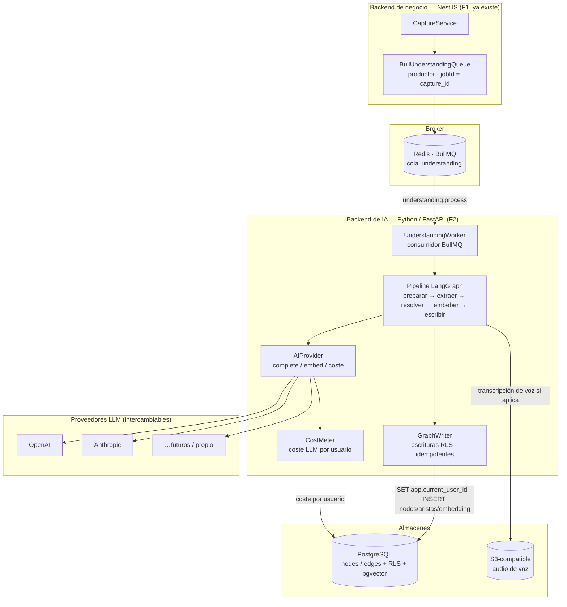
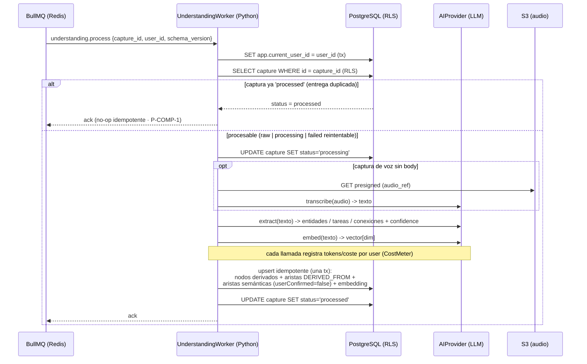
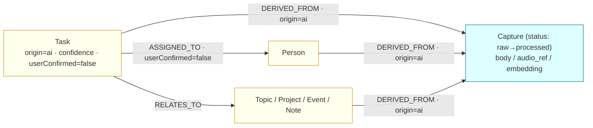
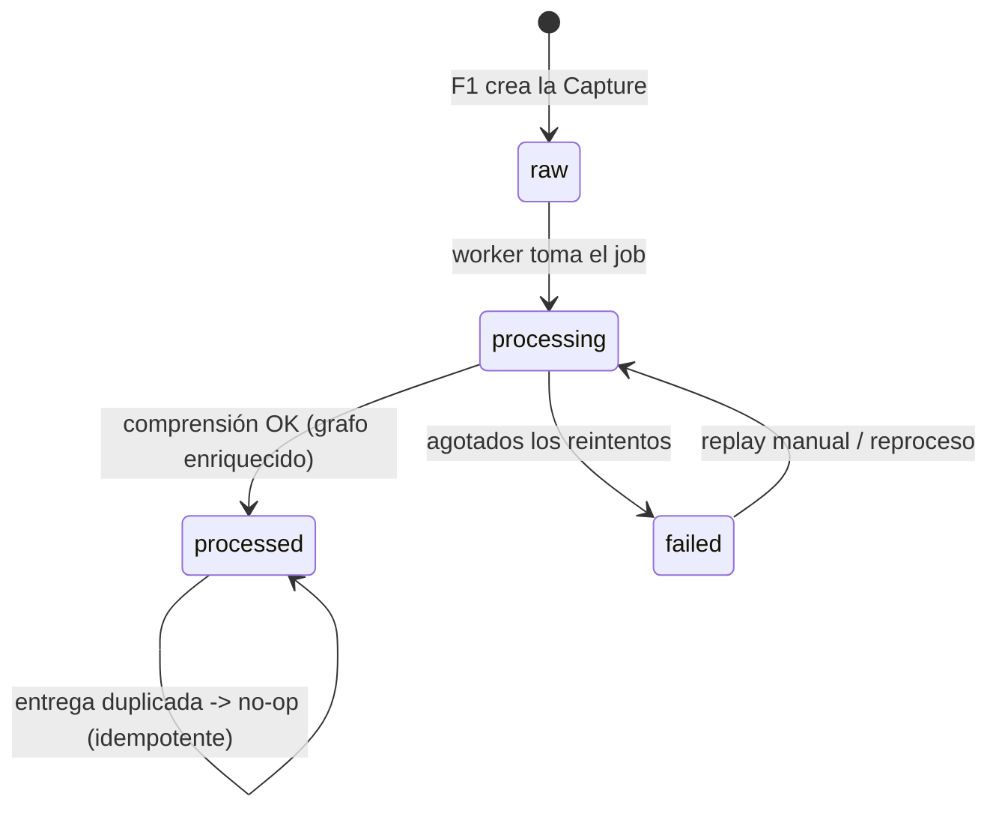

# Documento de Diseño — Comprehension Engine (F2)

| Metadato | Valor |
|----------|-------|
| Versión | 0.1 (borrador para revisión) |
| Estado | Borrador |
| Autor | Ingeniería (spec design-first) |
| Fase | F2 — Motor de Comprensión con IA ([#08 Roadmap](../../../docs/08-roadmap/technical-roadmap.md)) |
| Ámbito | Diseño técnico del motor de comprensión: consumo del trabajo de la cola, worker Python/LangGraph, capa `AIProvider` (complete/embed + coste), enriquecimiento del grafo (nodos derivados, aristas tipadas, provenance), embeddings + pgvector (migración SQL + HNSW), idempotencia y transiciones de estado bajo RLS, y arnés de evaluación para de-riesgar R-001 |
| Depende de | [ADR-010](../../../docs/02-architecture/adr/ADR-010-final-stack-and-two-backends.md), [ADR-012](../../../docs/02-architecture/adr/ADR-012-canonical-stack.md), [#03 Data Model](../../../docs/03-data/data-architecture-and-domain-model.md), [#02 TAD](../../../docs/02-architecture/technical-architecture.md), [002 Constitución](../../../docs/000_SYSTEM/002_ENGINEERING_CONSTITUTION.md), **Diseño F1 (Capture Engine)** (`../capture-engine/design.md`) |
| Riesgos/deuda vinculados | [R-001](../../../docs/000_SYSTEM/012_RISK_AND_DEBT_REGISTER.md) (calidad de comprensión — riesgo #1), ADR-013 (pendiente) (puente cola↔Python), D-008 (dimensión de embedding / proveedor) |
| Última actualización | 2026-07-02 |

---

## 1. Overview

El **Comprehension Engine** es el segundo tercio del bucle de valor de mindOS
(**capturar → comprender → recuperar**). Es el **consumidor** del trabajo
`understanding.process` que F1 (Capture Engine) ya produce: toma una `Capture`
cruda (`status=raw`), la **entiende** con ayuda de un LLM y **enriquece el grafo**
de conocimiento del usuario con nodos derivados (Note, Task, Person, Project,
Event, Topic…), aristas tipadas y su procedencia (`DERIVED_FROM`), además de
generar y almacenar **embeddings** para la recuperación semántica (F3).

Dos principios inmutables de la Constitución
([002](../../../docs/000_SYSTEM/002_ENGINEERING_CONSTITUTION.md)) gobiernan este
diseño: **la captura cruda es sagrada** (§9) y **el fallo del pipeline de IA nunca
pierde la captura** (§10). En consecuencia, F2 nunca muta ni borra el `body` de la
`Capture`; sólo transiciona su `status` (`raw → processing → processed | failed`)
y **añade** nodos/aristas alrededor. Un fallo definitivo de comprensión deja la
captura intacta en `status=failed`, lista para replay. Un tercer principio de
producto también es inmutable: **"la IA propone, el usuario confirma"** — todo
nodo/arista que nace de la IA nace **sin confirmar** (`userConfirmed=false`) y con
una `confidence`.

Este diseño resuelve además dos cuestiones estratégicas que el resto de F2
depende de ellas:

1. **El puente cola↔Python** (§9): BullMQ nace en el ecosistema Node/Redis, pero
   la lógica de comprensión (LangGraph/LlamaIndex, ADR-012) vive en Python. Se
   evalúan las opciones y se **recomienda una** (consumidor BullMQ nativo en
   Python) con sus trade-offs.
2. **De-riesgar R-001 primero** (§13): la **calidad de comprensión es nuestro
   mayor riesgo**. Antes de invertir en el pipeline completo, F2 front-loadea una
   **Prueba de Concepto (PoC) aislada** más un **arnés de evaluación** (eval set +
   métricas + **umbral de aceptación**) que debemos superar como puerta de
   entrada al resto de la implementación.

> **Nota sobre deriva documental:** el stack de verdad es ADR-010/012 (dos
> backends: **NestJS** para negocio y **Python+FastAPI** para IA; **LangGraph**
> para orquestar agentes; **LlamaIndex**; **pgvector**; LLMs intercambiables tras
> `AIProvider`; **BullMQ sobre Redis**). Se ignoran las menciones pre-ADR-010 a
> "FastAPI único" o a frontends web.

### 1.1 Fuera de alcance de F2

- La **recuperación semántica / RAG** (búsqueda por embedding, respuestas): es F3.
  F2 sólo **genera y guarda** los embeddings; no los consulta.
- La **UI de confirmación** de sugerencias de IA (aceptar/rechazar aristas): la
  superficie móvil es de otra fase. F2 garantiza el estado `userConfirmed=false`.
- **Endurecimiento de auth** ([R-002]) y realtime push de `capture.processed`
  (llega con la capa realtime; F2 sólo actualiza `status`, la app hace polling
  como en F1 §7).

---

# PARTE A — DISEÑO DE ALTO NIVEL (Diagramas e Interfaces)

## 2. Architecture

El Comprehension Engine es un **bounded context "Understanding"** que vive en el
backend de IA **Python/FastAPI** ([ADR-010](../../../docs/02-architecture/adr/ADR-010-final-stack-and-two-backends.md)).
Consume el trabajo que NestJS produjo en F1 y escribe en el **mismo** PostgreSQL
del grafo, siempre **bajo el contexto RLS** del `user_id` del trabajo.



**Frontera de responsabilidad (F2):**

| Responsabilidad | Dueño en F2 |
|-----------------|-------------|
| Producir `understanding.process` | NestJS `CaptureModule` — **F1, ya existe** |
| Consumir el trabajo (retries/backoff/dedup) | Python `UnderstandingWorker` |
| Orquestar el pipeline de comprensión | Python + **LangGraph** |
| Toda llamada a LLM / embeddings | Python `AIProvider` (implementaciones intercambiables) |
| Coste de LLM por usuario | Python `CostMeter` |
| Escritura idempotente en el grafo bajo RLS | Python `GraphWriter` |
| Migración pgvector + índice HNSW | Migración SQL (repo `apps/api/prisma`, propietaria del esquema) |
| Transcripción de voz (si `audio_ref` sin `body`) | Python (vía `AIProvider`/STT) |
| Confirmación de sugerencias por el usuario | Superficie móvil — **fuera de alcance** |

> **Propiedad del esquema.** El esquema Prisma vive en `apps/api` (NestJS). La
> columna `embedding` y los índices pgvector se añaden mediante una **migración
> SQL cruda** en ese repo (Prisma no tipa `pgvector`), pero el **worker Python**
> lee/escribe esa columna con SQL crudo. Contrato compartido, no dos esquemas.

## 3. Sequence Diagram — flujo de comprensión (camino feliz)



**Ruta de fallo (resumen; detalle en §12 y §14):** si cualquier paso lanza una
excepción, la transacción de escritura **no** se compromete (la `Capture` cruda
nunca se toca). BullMQ reintenta (`attempts:5`, backoff exponencial — ya
configurado en F1). Al agotar reintentos, el worker fija `status='failed'` y el
job queda en la cola de fallidos (`removeOnFail:false`) para inspección/replay.

## 4. Modelo de datos del enriquecimiento

F1 dejó **físicamente** las tablas `nodes` y `edges` listas (sólo escribía
`Capture`). F2 empieza a poblar el resto del property graph y añade la columna de
embedding.



**Invariantes del enriquecimiento (validados en §12):**

- **Provenance obligatoria (#03).** Todo nodo derivado por F2 tiene **exactamente
  una** arista `DERIVED_FROM` (`origin=ai`) que apunta a su `Capture` de origen.
  Sin captura de origen no existe el nodo derivado.
- **"La IA propone, el usuario confirma".** Todo nodo/arista con `origin=ai` nace
  con `userConfirmed=false` y una `confidence ∈ [0,1]`. F2 nunca marca
  `userConfirmed=true`.
- **La captura es sagrada.** F2 nunca modifica `body`, `origin`, `occurred_at` ni
  `type` de la `Capture`; sólo su `status` y su `embedding`.
- **Aislamiento por usuario.** Todo nodo/arista derivado hereda el `user_id` del
  trabajo; jamás se escribe con otro `user_id` (RLS `WITH CHECK`, §8 de F1).

### 4.1 Taxonomía de nodos y aristas que F2 produce (v1)

| Nodo derivado | Cuándo se crea | Campos clave (`attributes`) |
|---------------|----------------|-----------------------------|
| `task` | La captura expresa una acción/pendiente | `due_at?`, `priority?` |
| `person` | Se menciona a una persona | `display_name` |
| `project` | Se menciona un proyecto/iniciativa | `name` |
| `event` | Se menciona una cita/evento con tiempo | `starts_at?` |
| `topic` | Tema/etiqueta semántica | `label` |
| `note` | Contenido reflexivo sin acción | — |

| Arista (tipo) | Origen → Destino | Semántica |
|---------------|------------------|-----------|
| `derived_from` | nodo derivado → `Capture` | Procedencia (#03). **Obligatoria.** |
| `mentions` | `Capture`/`note` → `person`/`project`/`topic` | Mención detectada |
| `assigned_to` | `task` → `person` | Responsable propuesto |
| `relates_to` | derivado ↔ derivado | Conexión semántica genérica |

> La taxonomía v1 es deliberadamente pequeña. Se amplía sólo cuando el arnés de
> evaluación (§13) muestre que el LLM la extrae con calidad ≥ umbral.

---

# PARTE B — DISEÑO DE BAJO NIVEL (Code-First)

## 5. Migración pgvector (SQL crudo + índice HNSW)

Prisma no tipa `pgvector`, así que la columna y los índices se añaden con una
**migración SQL cruda** en `apps/api/prisma/migrations` (dueño del esquema). El
worker Python la usa con SQL crudo.

```sql
-- apps/api/prisma/migrations/2026XXXX_f2_pgvector/migration.sql

-- 1) Extensión (idempotente).
CREATE EXTENSION IF NOT EXISTS vector;

-- 2) Columna de embedding en 'nodes'. La DIMENSIÓN depende del proveedor
--    (decisión abierta D-008). Se parametriza como :dim en el diseño; la
--    migración fija el valor elegido tras la PoC (p.ej. 1536 para OpenAI
--    text-embedding-3-small, 1024 para otros). Cambiarla luego exige
--    reindexar: por eso se decide con datos ANTES del pipeline completo.
ALTER TABLE nodes ADD COLUMN IF NOT EXISTS embedding vector(1536);

-- 3) Metadatos del embedding para trazabilidad y migraciones de modelo.
ALTER TABLE nodes ADD COLUMN IF NOT EXISTS embedding_model text;

-- 4) Índice ANN HNSW por distancia coseno. Parcial: sólo filas con embedding.
--    El índice respeta RLS en tiempo de consulta (la política filtra por user).
CREATE INDEX IF NOT EXISTS idx_nodes_embedding_hnsw
    ON nodes USING hnsw (embedding vector_cosine_ops)
    WITH (m = 16, ef_construction = 64)
    WHERE embedding IS NOT NULL;

-- 5) Coste de LLM por usuario (métrica de primera clase, #02).
CREATE TABLE IF NOT EXISTS llm_usage (
    id            uuid PRIMARY KEY DEFAULT gen_random_uuid(),
    user_id       uuid NOT NULL REFERENCES users(id) ON DELETE CASCADE,
    capture_id    uuid REFERENCES nodes(id) ON DELETE SET NULL,
    provider      text NOT NULL,          -- 'openai' | 'anthropic' | ...
    model         text NOT NULL,
    operation     text NOT NULL,          -- 'complete' | 'embed' | 'transcribe'
    input_tokens  integer NOT NULL DEFAULT 0,
    output_tokens integer NOT NULL DEFAULT 0,
    cost_usd      numeric(12,6) NOT NULL DEFAULT 0,
    created_at    timestamptz NOT NULL DEFAULT now()
);
CREATE INDEX IF NOT EXISTS idx_llm_usage_user ON llm_usage (user_id, created_at);

-- 6) RLS también sobre llm_usage (mismo patrón fail-closed que el grafo).
ALTER TABLE llm_usage ENABLE ROW LEVEL SECURITY;
ALTER TABLE llm_usage FORCE  ROW LEVEL SECURITY;
CREATE POLICY llm_usage_isolation ON llm_usage
    USING      (user_id = current_setting('app.current_user_id', true)::uuid)
    WITH CHECK (user_id = current_setting('app.current_user_id', true)::uuid);
```

> **Nota RLS + HNSW:** el índice acelera el vecino más cercano; el **aislamiento**
> lo sigue garantizando la política RLS de `nodes` (heredada de F1 §6), que se
> aplica sobre el resultado. La búsqueda ANN de F3 correrá siempre dentro de
> `withUser(user_id)`.

## 6. Contrato con la cola (consumo del job de F1)

El worker consume el **mismo** contrato que F1 produce (no se cambia). Se replica
como referencia y se versiona (`schema_version`) para evolución sin romper.

```python
# apps/ai/app/understanding/contract.py
from pydantic import BaseModel, Field

class UnderstandingJobData(BaseModel):
    """Espejo del contrato de F1 (understanding.queue.port.ts).

    schema_version permite evolucionar el mensaje sin romper al consumidor:
    un valor desconocido -> se rechaza explícitamente (no se adivina).
    """
    schema_version: int = Field(..., ge=1)
    capture_id: str
    user_id: str
    enqueued_at: str

# Constantes compartidas con F1 (misma cola / mismo job name).
UNDERSTANDING_QUEUE = "understanding"
UNDERSTANDING_JOB = "understanding.process"
```

## 7. Capa `AIProvider` (anti-lock-in, ADR-012 D4)

**Toda** llamada a LLM/embeddings/STT pasa por esta abstracción. Se extiende el
contrato F0 (`complete`, `embed`) para que cada llamada devuelva también su
**uso/coste**, de modo que el `CostMeter` pueda atribuir coste por usuario sin
acoplarse a ningún proveedor.

```python
# apps/ai/app/providers/base.py  (evolución del contrato F0)
from abc import ABC, abstractmethod
from dataclasses import dataclass

@dataclass(frozen=True)
class Usage:
    """Uso atribuible de una llamada al modelo (base del coste por usuario)."""
    provider: str
    model: str
    operation: str          # 'complete' | 'embed' | 'transcribe'
    input_tokens: int
    output_tokens: int
    cost_usd: float

@dataclass(frozen=True)
class Completion:
    text: str
    usage: Usage

@dataclass(frozen=True)
class Embedding:
    vector: list[float]
    dim: int
    usage: Usage

class AIProvider(ABC):
    """Contrato que todo proveedor de modelos debe implementar (ADR-012 D4)."""

    @abstractmethod
    async def complete(self, prompt: str, *, schema: dict | None = None) -> Completion:
        """Completar/estructurar texto. `schema` fuerza salida JSON tipada."""

    @abstractmethod
    async def embed(self, text: str) -> Embedding:
        """Embedding del texto. `dim` es propio del proveedor/modelo (D-008)."""

    @abstractmethod
    async def transcribe(self, audio_bytes: bytes, content_type: str) -> Completion:
        """Transcribe voz -> texto (usado si la captura de voz no trae body)."""
```

**Implementaciones intercambiables (v1):** `OpenAIProvider`, `AnthropicProvider`.
La selección es por configuración (`settings.llm_provider`), nunca por `import`
directo en el dominio. Un `FakeProvider` determinista respalda los tests y el
arnés de evaluación (§13).

```python
# apps/ai/app/providers/factory.py
def build_provider(settings: Settings) -> AIProvider:
    match settings.llm_provider:
        case "openai":    return OpenAIProvider(settings)
        case "anthropic": return AnthropicProvider(settings)
        case "fake":      return FakeProvider()          # tests / eval offline
        case other:       raise ValueError(f"proveedor LLM desconocido: {other}")
```

### 7.1 Coste de LLM por usuario (`CostMeter`, métrica de primera clase #02)

```python
# apps/ai/app/understanding/cost_meter.py
class CostMeter:
    """Persiste el uso/coste de cada llamada al modelo, atribuido al usuario.

    Se escribe DENTRO del contexto RLS del user (tabla llm_usage, §5), de modo
    que el coste queda aislado por usuario igual que el resto de sus datos.
    """
    async def record(self, tx, user_id: str, capture_id: str, usage: Usage) -> None:
        await tx.execute(
            """INSERT INTO llm_usage
                 (user_id, capture_id, provider, model, operation,
                  input_tokens, output_tokens, cost_usd)
               VALUES ($1,$2,$3,$4,$5,$6,$7,$8)""",
            user_id, capture_id, usage.provider, usage.model, usage.operation,
            usage.input_tokens, usage.output_tokens, usage.cost_usd,
        )
```

## 8. El worker: pipeline LangGraph + escritura idempotente bajo RLS

### 8.1 Puente cola↔Python — **decisión** (ver evaluación completa en §9)

Se adopta un **consumidor BullMQ nativo en Python** (paquete `bullmq` oficial de
taskforcesh): un único proceso Python consume la cola `understanding` y ejecuta el
pipeline. Motivo: co-loca el ciclo de vida del job con la lógica de IA (LangGraph),
evita un salto de red y un segundo proceso Node, y respeta el contrato de F1 sin
cambios. Contingencia documentada (worker Node fino + HTTP) en §9.

```python
# apps/ai/app/understanding/worker.py
from bullmq import Worker
from app.understanding.contract import (
    UnderstandingJobData, UNDERSTANDING_QUEUE, UNDERSTANDING_JOB,
)

async def process(job, token) -> None:
    """Handler de un job. Idempotente por diseño (P-COMP-1).

    Precondición:  job.data valida contra UnderstandingJobData.
    Postcondición: la Capture queda 'processed' con su grafo enriquecido, o
                   'failed' sin perder el body crudo; nunca datos de otro user.
    """
    data = UnderstandingJobData(**job.data)
    if data.schema_version != 1:
        raise ValueError(f"schema_version no soportado: {data.schema_version}")
    if job.name != UNDERSTANDING_JOB:
        raise ValueError(f"job inesperado: {job.name}")
    await run_understanding(data.capture_id, data.user_id)

def build_worker(settings) -> Worker:
    # concurrency limita jobs simultáneos; conecta al MISMO Redis que F1.
    return Worker(UNDERSTANDING_QUEUE, process,
                  {"connection": settings.redis_url, "concurrency": 4})
```

### 8.2 Orquestación del pipeline (LangGraph)

```python
# apps/ai/app/understanding/pipeline.py  (estructura del grafo de estados)
#
#   prepare ─▶ extract ─▶ resolve ─▶ embed ─▶ persist
#      │          │           │         │         │
#   carga     LLM: entidades  dedup   AIProvider  GraphWriter (una tx RLS)
#   captura   /tareas/enlaces  contra  .embed()   nodos+aristas+embedding+status
#   (+STT)    (JSON tipado)    grafo             + CostMeter
#
async def run_understanding(capture_id: str, user_id: str) -> None:
    async with rls_tx(user_id) as tx:                    # SET app.current_user_id
        capture = await load_capture(tx, capture_id)
        if capture is None:
            return                                       # RLS: no es de este user / no existe
        if capture["status"] == "processed":
            return                                       # entrega duplicada -> no-op (P-COMP-1)
        await set_status(tx, capture_id, "processing")

    # Trabajo de IA FUERA de la transacción (llamadas de red largas).
    text = capture["body"] or await transcribe_if_voice(capture, user_id)
    extraction = await extract_entities(text)            # AIProvider.complete(schema=…)
    embedding  = await provider.embed(text)

    # Escritura idempotente en UNA transacción RLS (todo-o-nada).
    try:
        async with rls_tx(user_id) as tx:
            await graph_writer.upsert_enrichment(
                tx, user_id, capture_id, extraction, embedding)
            await cost_meter.record_all(tx, user_id, capture_id, used_usages)
            await set_status(tx, capture_id, "processed")
    except Exception:
        # La Capture cruda NUNCA se tocó. Se relanza para que BullMQ reintente;
        # al agotar attempts, on_failed fija status='failed' (§14).
        raise
```

### 8.3 `GraphWriter` — upsert idempotente y provenance obligatoria

La idempotencia se logra con una **clave natural determinista** por nodo derivado:
`dedup_key = hash(user_id, capture_id, node_type, normalized_label)`, almacenada en
`attributes.dedup_key` con un índice único parcial. Reprocesar la misma captura
hace `ON CONFLICT DO NOTHING` → sin duplicados (P-COMP-2).

```python
# apps/ai/app/understanding/graph_writer.py
class GraphWriter:
    async def upsert_enrichment(self, tx, user_id, capture_id, extraction, embedding):
        # 1) Embedding en la propia Capture (SQL crudo; Prisma no tipa vector).
        await tx.execute(
            "UPDATE nodes SET embedding = $1, embedding_model = $2 WHERE id = $3",
            embedding.vector, embedding.usage.model, capture_id)

        # 2) Nodos derivados (upsert idempotente por dedup_key).
        for ent in extraction.entities:
            node_id = await tx.fetchval(
                """INSERT INTO nodes (user_id, type, title, attributes,
                                      origin, status, confidence)
                   VALUES ($1,$2,$3,$4,'ai','processed',$5)
                   ON CONFLICT (user_id, ((attributes->>'dedup_key')))
                   DO UPDATE SET confidence = EXCLUDED.confidence
                   RETURNING id""",
                user_id, ent.type, ent.title,
                {"dedup_key": ent.dedup_key, **ent.attributes}, ent.confidence)

            # 3) Provenance OBLIGATORIA: derived_from -> Capture (P-COMP-3).
            await self._upsert_edge(tx, user_id, node_id, capture_id,
                                    "derived_from", origin="ai",
                                    confidence=ent.confidence)

        # 4) Aristas semánticas propuestas (mentions/assigned_to/relates_to),
        #    todas userConfirmed=false (P-COMP-4).
        for e in extraction.edges:
            await self._upsert_edge(tx, user_id, e.source_id, e.target_id,
                                    e.type, origin="ai", confidence=e.confidence)

    async def _upsert_edge(self, tx, user_id, src, dst, etype, *, origin, confidence):
        await tx.execute(
            """INSERT INTO edges (user_id, type, source_node_id, target_node_id,
                                  origin, confidence, user_confirmed)
               VALUES ($1,$2,$3,$4,$5,$6,false)
               ON CONFLICT (user_id, source_node_id, target_node_id, type)
               DO NOTHING""",
            user_id, etype, src, dst, origin, confidence)
```

> Requiere dos índices únicos parciales añadidos por la migración de F2:
> `UNIQUE (user_id, (attributes->>'dedup_key')) WHERE origin='ai'` en `nodes`, y
> `UNIQUE (user_id, source_node_id, target_node_id, type) WHERE origin='ai'` en
> `edges`. Son la base física de la idempotencia (P-COMP-2/3).

### 8.4 Contexto RLS en Python (mismo patrón fail-closed que F1)

```python
# apps/ai/app/understanding/rls.py
from contextlib import asynccontextmanager

@asynccontextmanager
async def rls_tx(user_id: str):
    """Abre una transacción y fija app.current_user_id (parametrizado).

    set_config(..., true) => local a la transacción: una conexión del pool
    nunca filtra el contexto de un usuario al siguiente (fail-closed, F1 §6).
    """
    async with pool.acquire() as conn:
        async with conn.transaction():
            await conn.execute(
                "SELECT set_config('app.current_user_id', $1, true)", user_id)
            yield conn
```

> El worker conecta como rol **no superusuario / no dueño de tabla**, para que
> `FORCE ROW LEVEL SECURITY` (F1 §6) aplique siempre: aun con un bug en una
> consulta, Postgres impide leer/escribir filas de otro usuario (P-COMP-4).

## 9. **Punto crítico:** puente cola↔Python — evaluación y decisión (ADR-013 pendiente)

BullMQ es del ecosistema Node/Redis; la comprensión es Python. Opciones:

| Opción | Descripción | Ventajas | Inconvenientes |
|--------|-------------|----------|----------------|
| **(a)** Worker Node fino + HTTP a Python | Un consumidor BullMQ en Node gestiona el ciclo de vida del job y delega la comprensión al servicio Python vía HTTP | BullMQ en su implementación de referencia (la más madura); tooling Node (bull-board) directo | **Dos procesos** y un **salto de red** por job; llamadas LLM largas sobre HTTP (timeouts/streaming); las escrituras al grafo se reparten entre dos lenguajes; más superficie que operar |
| **(b) ✅ Recomendada** Consumidor BullMQ nativo en Python | El servicio Python consume la cola directamente con el paquete oficial `bullmq` (taskforcesh) | **Un solo proceso**; ciclo de vida del job co-locado con LangGraph; sin salto de red extra; respeta el contrato de F1 tal cual; escritura al grafo en un único lenguaje | El port Python es **menos maduro** que el de Node; hay que fijar versión y cubrir con tests de integración contra Redis real (P-COMP-1) |
| **(c)** Cambiar de tecnología de cola | Sustituir BullMQ por Redis Streams directo / Celery / arq / taskiq en Python | Herramientas Python "de casa" | **Rompe el contrato y el productor de F1** (ya mergeado, `jobId=capture_id`); duplicaría la deuda; contradice ADR-012 D7 |

**Decisión:** **(b)**. Minimiza piezas móviles y honra el contrato ya en
producción de F1 sin un salto Node redundante. Se mitiga la menor madurez del port
Python **fijando versión** del paquete `bullmq`, y con **tests de integración
contra Redis real** que verifican: consumo, reintentos/backoff, dedup por `jobId`
(P-COMP-1) y `removeOnFail:false`. **Contingencia:** si el port Python resultara
insuficiente en operación (p.ej. features de grupos/rate-limit que necesitemos),
se conmuta a **(a)** — el pipeline LangGraph y el `GraphWriter` no cambian; sólo se
antepone un consumidor Node que invoca `run_understanding` vía un endpoint interno
del servicio de IA. Registrada como **ADR-013 (pendiente)** — decisión de diseño a
ratificar como ADR cuando se apruebe F2.

## 10. Transiciones de estado e idempotencia



- **`processed` es absorbente para el camino normal:** un job entregado dos veces
  (mismo `capture_id`) encuentra `status=processed` y hace **no-op** (P-COMP-1).
- **Idempotencia estructural:** aunque dos entregas corrieran a la vez, los
  índices únicos de `nodes`/`edges` (§8.3) + `ON CONFLICT` impiden duplicados
  (P-COMP-2/3).
- **`failed` conserva la captura cruda:** sólo cambia `status`; `body`/`audio_ref`
  intactos (P-COMP-5). El replay reencola con el mismo `jobId=capture_id`.

## 11. Estructura de módulos (bounded context Understanding, Python)

```
apps/ai/app/
├── main.py                      # FastAPI (health) — arranca también el worker
├── config.py                    # + llm_provider, dims, tarifas de coste
├── providers/
│   ├── base.py                  # AIProvider + Usage/Completion/Embedding (§7)
│   ├── openai_provider.py       # implementación intercambiable
│   ├── anthropic_provider.py    # implementación intercambiable
│   ├── fake_provider.py         # determinista (tests + eval offline)
│   └── factory.py               # build_provider(settings)
├── understanding/
│   ├── contract.py              # UnderstandingJobData (espejo de F1) (§6)
│   ├── worker.py                # consumidor BullMQ (§8.1)
│   ├── pipeline.py              # grafo LangGraph prepare→…→persist (§8.2)
│   ├── graph_writer.py          # upsert idempotente + provenance (§8.3)
│   ├── rls.py                   # rls_tx(user_id) fail-closed (§8.4)
│   └── cost_meter.py            # coste LLM por usuario (§7.1)
└── eval/                        # arnés de evaluación / de-riesgo R-001 (§13)
    ├── dataset/                 # eval set versionado (casos + gold labels)
    ├── metrics.py               # precisión/recall de extracción, etc.
    └── run_eval.py              # ejecuta el eval set y compara vs umbral
```

> Reglas #07 aplicables: `mypy --strict` (ver pyproject), sin `any` implícito,
> DTOs Pydantic validados en el borde (contrato del job), efectos (I/O, red) en
> los bordes y núcleo de extracción/normalización puro y testeable.

---

## 12. Correctness Properties

Propiedades verificables (candidatas a PBT, #07 §5). Continúan la numeración de F1
(P1–P9) con el prefijo `P-COMP` para el dominio de comprensión.

- **P-COMP-1 — Idempotencia de entrega (reproceso no duplica).**
  *Validates: Constitución §10; F1 P7; R-001.*
  Procesar el **mismo** `capture_id` N≥1 veces produce exactamente el mismo grafo:
  el mismo conjunto de nodos derivados y aristas, sin duplicados.
  ```
  ∀ c, N≥1:  process^N(c) ≡ process^1(c)   (mismo grafo resultante)
  ```

- **P-COMP-2 — Sin nodos derivados duplicados.** *Validates: §8.3.*
  Para toda captura procesada, no existen dos nodos `origin=ai` del mismo
  `(user_id, type, dedup_key)`. (Garantizado por el índice único + `ON CONFLICT`.)

- **P-COMP-3 — Provenance total.** *Validates: #03 (provenance), §4.*
  Todo nodo derivado por F2 tiene **exactamente una** arista `DERIVED_FROM` hacia
  su `Capture` de origen.
  ```
  ∀ n: derived(n) ⟹ |{e : e.type=derived_from ∧ e.source=n}| = 1 ∧ target(e) = capture(n)
  ```

- **P-COMP-4 — Aislamiento por usuario (el worker nunca cruza usuarios).**
  *Validates: RLS F1 §6; Constitución §7.*
  Todo nodo/arista/registro de coste escrito por un job hereda el `user_id` del
  trabajo; ninguna escritura afecta filas de `u' ≠ u`, y una consulta sin contexto
  no lee ni escribe nada (fail-closed).
  ```
  ∀ job(u): writes(job) ⊆ rows(u)   ∧   context=∅ ⟹ writes=∅ ∧ reads=∅
  ```

- **P-COMP-5 — La captura sobrevive al fallo.** *Validates: Constitución §9, §10.*
  Si la comprensión falla definitivamente, la `Capture` conserva intacto su
  contenido crudo (`body`/`audio_ref`) y queda en `status=failed` (recuperable).
  ```
  ∀ c: fail(c) ⟹ body(c) sin cambios ∧ status(c) = failed ∧ recoverable(c)
  ```

- **P-COMP-6 — La IA propone, no confirma.** *Validates: Constitución (producto).*
  Todo nodo/arista con `origin=ai` creado por F2 tiene `userConfirmed=false` y
  `confidence ∈ [0,1]`.

- **P-COMP-7 — La captura es sagrada (append-only alrededor).**
  *Validates: Constitución §9.*
  Tras procesar, `body`, `origin`, `type` y `occurred_at` de la `Capture` son
  idénticos a antes; sólo cambian `status` y `embedding`.

- **P-COMP-8 — Coste atribuido y no negativo.** *Validates: #02 (coste 1ª clase).*
  Toda llamada al modelo genera un registro en `llm_usage` con `cost_usd ≥ 0`
  atribuido al `user_id` del trabajo; la suma por captura es igual a la suma de
  las llamadas efectuadas para ella.

> **Mapa a PBT (§15):** P-COMP-1/2/3/6/7/8 son idóneas para property-based testing
> con un `FakeProvider` determinista (sin coste ni red). P-COMP-4/5 se validan con
> integración real (Postgres+RLS, rol no-owner; y fallo forzado del provider).

## 13. De-riesgar R-001 primero — PoC + arnés de evaluación

**R-001 (calidad de comprensión) es el riesgo #1.** Antes de construir el pipeline
completo, F2 ejecuta una **PoC aislada** con un **arnés de evaluación** que actúa
como **puerta de calidad**: si no superamos el umbral, no invertimos en el resto.

### 13.1 Qué medimos (eval set + gold labels)

Un **eval set versionado** (`apps/ai/app/eval/dataset/`) de capturas reales/sintéticas
representativas (texto y transcripciones de voz), cada una con **etiquetas gold**
anotadas a mano: entidades esperadas, tareas esperadas y conexiones esperadas.

| Métrica | Qué evalúa | Definición |
|---------|------------|------------|
| **Precisión de extracción de entidades** | ¿Las entidades extraídas son correctas? | `TP / (TP + FP)` sobre entidades (tipo + label normalizado) |
| **Recall de extracción de entidades** | ¿Capturamos las que debíamos? | `TP / (TP + FN)` |
| **F1 de entidades** | Balance P/R | media armónica |
| **Precisión de tareas** | ¿Detectamos acciones reales (no ruido)? | `TP / (TP+FP)` sobre nodos `task` |
| **Calidad de conexiones** | ¿Las aristas propuestas son plausibles? | `TP / (TP+FP)` sobre aristas vs gold |
| **Tasa de alucinación** | ¿Inventa entidades inexistentes? | `FP / total_propuestas` (**cota superior**) |
| **Coste medio por captura** | Viabilidad económica (#02) | `Σ cost_usd / nº capturas` |
| **Latencia p95 por captura** | Viabilidad operativa | p95 del tiempo de pipeline |

### 13.2 Umbral de aceptación (puerta)

La PoC debe superar, sobre el eval set, un umbral acordado como condición para
continuar (valores iniciales propuestos, a ratificar con el dueño de producto):

```
F1_entidades         ≥ 0.80
Precisión_tareas      ≥ 0.85
Tasa_alucinación      ≤ 0.05
Coste_medio/captura   ≤ (presupuesto acordado)   # métrica #02
```

- **Si se supera:** se procede al pipeline completo (§8) y se **fija la dimensión
  de embedding y el proveedor** con datos (cierra parte de D-008).
- **Si no se supera:** se itera **sólo** sobre prompts/estrategia de extracción y
  elección de modelo (todo tras `AIProvider`, coste acotado) **antes** de invertir
  en integración, migraciones y worker productivo. Evita construir sobre un motor
  que no entiende bien.

### 13.3 Cómo se ejecuta

```python
# apps/ai/app/eval/run_eval.py  (esqueleto)
async def run_eval(provider: AIProvider, dataset: list[EvalCase]) -> EvalReport:
    results = [score(await extract_entities(c.text, provider), c.gold)
               for c in dataset]
    report = aggregate(results)          # F1, precisión tareas, alucinación, coste, p95
    report.assert_thresholds(THRESHOLDS) # falla la puerta si no se cumplen
    return report
```

- Reproducible y **offline-capable**: puede correr con respuestas grabadas por
  proveedor para comparar modelos sin gasto repetido.
- Se integra en CI como job **informativo** al principio (baseline) y como
  **gate** cuando el eval set madure. El eval set se versiona con el código.

## 14. Error Handling

Envoltura y principios heredados (#04/#07). El worker no expone HTTP al cliente;
su "respuesta" es el ack/fallo del job y la transición de estado.

| Escenario | Condición | Comportamiento | Recuperación |
|-----------|-----------|----------------|--------------|
| `schema_version` desconocido | Contrato futuro no soportado | Se rechaza explícitamente (no se adivina) | Desplegar consumidor que lo soporte; replay |
| Captura no encontrada / de otro user | RLS no la devuelve | No-op silencioso (nunca error con datos) | — (aislamiento correcto) |
| Entrega duplicada | `status=processed` | No-op idempotente (P-COMP-1) | — |
| Fallo transitorio del LLM (timeout/429) | Excepción en `complete/embed` | Excepción → BullMQ reintenta (backoff exp.) | Reintentos automáticos (`attempts:5`) |
| Fallo definitivo (agotados reintentos) | `on_failed` | `UPDATE status='failed'`; job en cola de fallidos (`removeOnFail:false`) | Inspección + replay; **captura intacta** (P-COMP-5) |
| Salida del LLM no válida (JSON malformado) | Falla validación del `schema` | Se trata como fallo del intento (reintenta); si persiste → `failed` | Ajuste de prompt; replay |
| Redis caído | Worker no recibe jobs | El barrido de reconciliación de F1 reencola `raw` | Se drena al recuperar Redis |
| Presupuesto de coste excedido (futuro) | `CostMeter` supera límite del user | (política a definir con producto) | Decisión abierta (§17) |

```python
# apps/ai/app/understanding/worker.py  (on_failed: sólo tras agotar attempts)
async def on_failed(job, err) -> None:
    if job.attemptsMade >= job.opts["attempts"]:
        data = UnderstandingJobData(**job.data)
        async with rls_tx(data.user_id) as tx:      # bajo el contexto del dueño
            await set_status(tx, data.capture_id, "failed")
        logger.error("comprensión fallida capture=%s user=%s: %s",
                     data.capture_id, data.user_id, err)
```

## 15. Testing Strategy

- **Unit (Python):** extracción/normalización pura (núcleo determinista con
  `FakeProvider`), `GraphWriter` (dedup_key, provenance), `CostMeter` (atribución),
  `factory.build_provider` (selección por config).
- **Property-Based (PBT):** propiedades P-COMP-1/2/3/6/7/8 con **Hypothesis**
  (Python). Foco en idempotencia (reproceso), provenance total, "IA propone" y
  coste no-negativo, usando `FakeProvider` determinista.
- **Integración (real):**
  - **Postgres + RLS con rol no-owner:** P-COMP-4 (aislamiento) y P-COMP-5 (fallo
    conserva la captura) de verdad, no mockeado; pgvector: inserción y consulta
    ANN básica.
  - **Redis + BullMQ real:** consumo, reintentos/backoff, **dedup por `jobId`**
    (P-COMP-1) y `removeOnFail:false`.
- **Evaluación (§13):** el arnés `run_eval` es la prueba de **calidad** (R-001),
  separada de la corrección funcional; corre en CI como baseline→gate.
- **Cobertura:** ≥ 80 % en lógica de dominio (#07); el `GraphWriter` y la máquina
  de estados aspiran a más.

## 16. Performance & Cost Considerations

- **Asincronía total (Constitución §12):** la comprensión (coste LLM/CPU) vive
  100 % fuera del camino síncrono de captura; no afecta al SLO p95<300 ms de F1.
- **Trabajo de red fuera de la transacción:** las llamadas al LLM ocurren **entre**
  transacciones cortas; la escritura al grafo es una transacción breve todo-o-nada
  (§8.2), para no mantener conexiones/locks durante llamadas lentas.
- **`concurrency` del worker** acota jobs simultáneos (protege Postgres y el rate
  limit del proveedor). Escala horizontal añadiendo réplicas del worker.
- **Coste como métrica de 1ª clase (#02):** `llm_usage` permite cuadros de mando
  de coste por usuario y detectar derivas; base de futuros presupuestos por user.
- **HNSW** (`m=16`, `ef_construction=64`) equilibra recall/latencia de la ANN de
  F3; parámetros ajustables tras medir con datos reales.

## 17. Security Considerations

- **Aislamiento (doble capa):** el worker filtra por `user_id` del trabajo **y**
  RLS fail-closed en Postgres (rol no-owner + `FORCE RLS`). `user_id` proviene del
  mensaje firmado por F1, nunca de contenido libre. (P-COMP-4.)
- **Secretos de proveedor:** claves de LLM sólo por variables de entorno del
  servicio de IA; nunca en el grafo, logs ni en `llm_usage`.
- **Contenido del usuario a terceros:** las capturas se envían al proveedor LLM
  elegido. La abstracción `AIProvider` permite conmutar a un proveedor con
  garantías de no-entrenamiento o a un modelo propio (anti-lock-in). Registrar el
  proveedor/model usado por captura (`embedding_model`, `llm_usage`) para
  trazabilidad y cumplimiento.
- **Blobs de voz:** acceso vía presigned GET de vida corta (F1 §9); el binario
  nunca entra en Postgres.
- **PII:** el grafo enriquecido puede contener PII (personas, eventos). Hereda el
  aislamiento por usuario; futuras políticas de retención/borrado en fase posterior.

## 18. Dependencies

| Dependencia | Uso en F2 | Fuente |
|-------------|-----------|--------|
| Python + FastAPI | servicio de IA (host del worker) | ADR-010 |
| **LangGraph** | orquestación del pipeline de comprensión | ADR-012 D4 |
| **LlamaIndex** | utilidades de indexación/embeddings (según necesidad) | ADR-012 D4 |
| **pgvector** (extensión PostgreSQL) | columna `embedding` + índice HNSW | ADR-012 |
| `bullmq` (paquete Python, taskforcesh) | consumidor de la cola `understanding` | Decisión §9 (ADR-013 pendiente) |
| Redis + BullMQ | broker de la cola (compartido con F1) | ADR-012 D7 |
| Proveedores LLM (OpenAI/Anthropic/…) | `complete`/`embed`/`transcribe` tras `AIProvider` | ADR-012 D4 |
| PostgreSQL (+ RLS) | grafo `nodes`/`edges`, `llm_usage`, aislamiento | ADR-012 |
| `Hypothesis` | property-based testing (Python) | #07 §5 |
| NestJS Capture (F1) | **productor** del job (ya mergeado) | Diseño F1 |

---

## 19. Riesgos y decisiones abiertas

| Ref | Tema | Estado en este diseño |
|-----|------|-----------------------|
| [R-001](../../../docs/000_SYSTEM/012_RISK_AND_DEBT_REGISTER.md) | **Calidad de comprensión (riesgo #1)** | **De-riesgado primero**: PoC aislada + arnés de evaluación con eval set, métricas y **umbral de aceptación** como puerta antes del pipeline completo (§13). |
| **ADR-013 (pendiente)** | Puente cola↔Python | **Decidido**: consumidor BullMQ **nativo en Python** (§9), con contingencia documentada a worker Node+HTTP si el port Python resulta insuficiente. A ratificar como ADR al aprobar F2. |
| **D-008** | Dimensión de embedding / elección de proveedor | **Abierta**: se fija con datos tras la PoC (§13.2). La migración parametriza `vector(:dim)`; cambiarla luego exige reindexar, por eso se decide antes de invertir. |
| Abierta | Transcripción de voz: ¿cliente o F2? | F2 soporta ambas (usa `body` si viene; si no, `AIProvider.transcribe(audio_ref)`). Decisión final con datos de calidad/latencia (heredada de F1). |
| Abierta | Política ante presupuesto de coste por usuario excedido | Pendiente de producto (§14). `llm_usage` ya habilita medir; la acción (throttle/aviso) se define después. |
| Abierta | Taxonomía de nodos/aristas más allá de v1 | Se amplía sólo cuando el arnés muestre calidad ≥ umbral para nuevos tipos (§4.1). |
| Abierta | Reprocesado tras mejora del modelo | Replay por `jobId=capture_id` es idempotente; falta política de "reembeber todo" al cambiar de modelo de embedding (afecta a D-008). |

---

## Historial de versiones

| Versión | Fecha | Autor | Cambios |
|---------|-------|-------|---------|
| 0.1 | 2026-07-02 | Ingeniería | Diseño inicial del Comprehension Engine (F2): alto nivel (arquitectura del worker Python consumiendo BullMQ, secuencia de comprensión, modelo de datos del enriquecimiento con provenance) y bajo nivel (migración pgvector + HNSW + tabla de coste, contrato de cola, capa `AIProvider` con coste, pipeline LangGraph, `GraphWriter` idempotente, contexto RLS en Python, transiciones de estado). Resuelve el puente cola↔Python (decisión ADR-013 pendiente: consumidor BullMQ nativo en Python) y de-riesga R-001 primero con PoC + arnés de evaluación (eval set, métricas y umbral de aceptación). Incluye propiedades de correctitud P-COMP-1..8, manejo de errores, testing, rendimiento/coste, seguridad y riesgos/decisiones abiertas (R-001, ADR-013 pendiente, D-008). |
