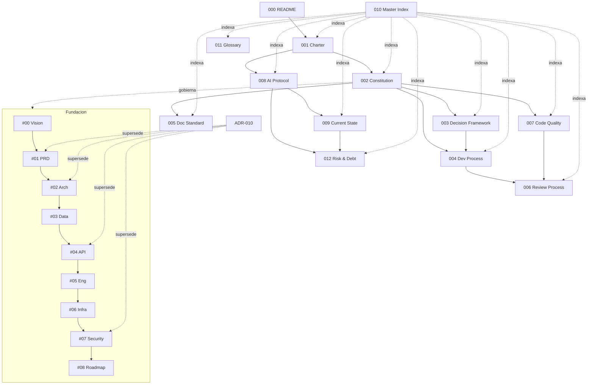

# 010 — Master Index

| Metadato | Valor |
|----------|-------|
| Versión | 1.0 |
| Estado | 🟢 Vigente |
| Ámbito | Mapa completo del conocimiento de mindOS y dueños de la verdad |
| Depende de | Toda la serie 000 y la cadena #00–#08 |
| Última actualización | 2026-07-02 |

## 1. Documentos de gobernanza (serie 000)
| # | Documento | Estado |
|---|-----------|--------|
| 000 | [README](./000_README.md) | 🟢 Vigente |
| 001 | [CPTO Charter](./001_CPTO_CHARTER.md) | 🟢 Vigente |
| 002 | [Engineering Constitution](./002_ENGINEERING_CONSTITUTION.md) | 🟢 Vigente |
| 003 | [Decision Framework](./003_DECISION_FRAMEWORK.md) | 🟢 Vigente |
| 004 | [Development Process](./004_DEVELOPMENT_PROCESS.md) | 🟢 Vigente |
| 005 | [Documentation Standard](./005_DOCUMENTATION_STANDARD.md) | 🟢 Vigente |
| 006 | [Review Process](./006_REVIEW_PROCESS.md) | 🟢 Vigente |
| 007 | [Code Quality](./007_CODE_QUALITY.md) | 🟢 Vigente |
| 008 | [AI Collaboration Protocol](./008_AI_COLLABORATION_PROTOCOL.md) | 🟢 Vigente |
| 009 | [Current State](./009_CURRENT_STATE.md) | 🟢 Vigente |
| 010 | [Master Index](./010_MASTER_INDEX.md) | 🟢 Vigente |
| 011 | [Glossary](./011_GLOSSARY.md) | 🟢 Vigente |
| 012 | [Risk & Debt Register](./012_RISK_AND_DEBT_REGISTER.md) | 🟢 Vigente |

## 2. Cadena de fundación (#00–#08)
| # | Documento | Estado |
|---|-----------|--------|
| 00 | [Vision & Problem Statement](../00-foundation/vision-and-problem-statement.md) | 🟢 Aprobado |
| 01 | [PRD](../01-product/prd.md) | 🟢 Aprobado (revisado por ADR-010) |
| 02 | [Technical Architecture](../02-architecture/technical-architecture.md) | 🟢 Aprobado (revisado por ADR-010) |
| 03 | [Data Architecture & Domain Model](../03-data/data-architecture-and-domain-model.md) | 🟢 Aprobado |
| 04 | [API Design Specification](../04-api/api-design-specification.md) | 🟢 Aprobado (revisado por ADR-010) |
| 05 | [Engineering Standards & Conventions](../05-engineering/engineering-standards-and-conventions.md) | 🟢 Aprobado |
| 06 | [Infrastructure & Deployment Strategy](../06-infrastructure/infrastructure-and-deployment-strategy.md) | 🟢 Aprobado |
| 07 | [Security & Privacy Framework](../07-security/security-and-privacy-framework.md) | 🟢 Aprobado (revisado por ADR-010) |
| 08 | [Roadmap Técnico](../08-roadmap/technical-roadmap.md) | 🟠 Aprobado con **deriva pendiente** (ver [R-004](./012_RISK_AND_DEBT_REGISTER.md)) |

## 3. Architecture Decision Records
| ADR | Título | Estado | Ubicación |
|-----|--------|--------|-----------|
| ADR-01..09 | Estilo, stack y frontend iniciales | 🔴 Parcialmente superados | Embebidos en [#02](../02-architecture/technical-architecture.md) (migración pendiente → [D-004](./012_RISK_AND_DEBT_REGISTER.md)) |
| ADR-010 | [Stack definitivo y dos backends](../02-architecture/adr/ADR-010-final-stack-and-two-backends.md) | 🟢 Aprobado | Archivo suelto (a normalizar como `ADR-0010`) |

## 4. Diagrama de dependencias

## 5. Dueño de la verdad por tema
| Tema | Autoridad |
|------|-----------|
| Visión y problema | [#00](../00-foundation/vision-and-problem-statement.md) |
| Requisitos de producto | [#01](../01-product/prd.md) |
| Arquitectura del sistema | [#02](../02-architecture/technical-architecture.md) + ADRs |
| Modelo de datos y grafo | [#03](../03-data/data-architecture-and-domain-model.md) |
| Contratos de API | [#04](../04-api/api-design-specification.md) |
| Estándares de ingeniería | [#05](../05-engineering/engineering-standards-and-conventions.md) + [007](./007_CODE_QUALITY.md) |
| Infraestructura y despliegue | [#06](../06-infrastructure/infrastructure-and-deployment-strategy.md) |
| Seguridad y privacidad | [#07](../07-security/security-and-privacy-framework.md) |
| Secuencia de construcción | [#08](../08-roadmap/technical-roadmap.md) |
| Decisiones estructurales | ADRs (`../02-architecture/adr/`) + [003](./003_DECISION_FRAMEWORK.md) |
| Estado actual del proyecto | [009](./009_CURRENT_STATE.md) |
| Riesgos y deuda | [012](./012_RISK_AND_DEBT_REGISTER.md) |
| Lenguaje ubicuo | [011](./011_GLOSSARY.md) |

## 6. Orden de lectura recomendado
000 → 001 → 002 → 009 → 012 → 003 → 004 → 005 → 006 → 007 → 008 → 010 → 011, y en paralelo la cadena #00 → #08.

## Historial de versiones
| Versión | Fecha | Cambios |
|---------|-------|---------|
| 1.0 | 2026-07-02 | Índice maestro inicial: gobernanza, fundación, ADRs, dependencias y dueños de la verdad. |
